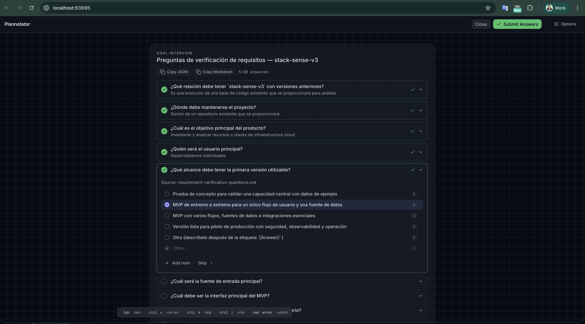
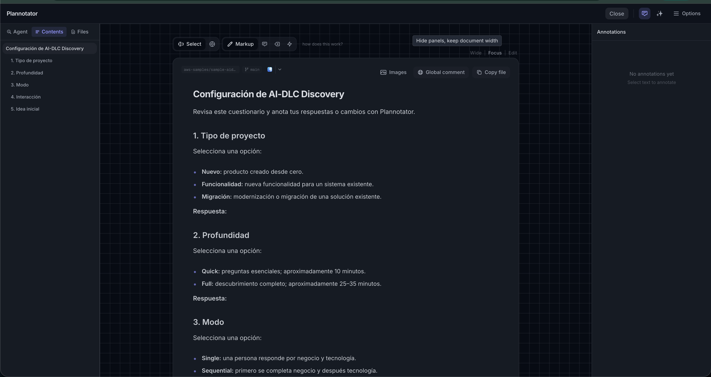

# Kiro CLI Plannotator Setup

This guide enables automatic AI-DLC question and approval gates in normal `kiro-cli chat --v3` sessions. The workspace MCP server opens Plannotator for an explicit AI-DLC artifact and returns a digest-bound typed decision.

## Prerequisites

Install and verify the following commands before starting Kiro:

- `kiro-cli` with the v3 agent engine and workspace MCP support.
- `uv` with Python 3.13 or later.
- `plannotator` on `PATH`.
- `gh`, authenticated for GitHub attestation verification, unless checksum verification is configured.

From the repository root, install the locked evaluator environment:

```bash
uv sync --project scripts/aidlc-evaluator --package aidlc-cli-harness
```

## Verify Plannotator Provenance

Attestation is the default policy:

```bash
gh attestation verify "$(command -v plannotator)" --repo backnotprop/plannotator
```

For an offline environment, obtain the SHA-256 digest through a trusted release process:

```bash
shasum -a 256 "$(command -v plannotator)"
```

Do not copy an unverified digest from the same untrusted download being checked.

## Register the Workspace MCP Server

Create `.kiro/settings/mcp.json` in the repository root with this workspace-scoped configuration:

```json
{
  "mcpServers": {
    "aidlc-plannotator-gate": {
      "command": "uv",
      "args": [
        "run",
        "--project",
        "scripts/aidlc-evaluator",
        "--package",
        "aidlc-cli-harness",
        "aidlc-plannotator-mcp",
        "--workspace",
        ".",
        "--verification",
        "attestation",
        "--timeout",
        "1800"
      ],
      "disabled": false,
      "autoApprove": [
        "review_aidlc_gate"
      ]
    }
  }
}
```

Autoapprove only `review_aidlc_gate`. Do not enable broad tool trust or move this server into global `~/.kiro` configuration.

For checksum verification, replace the verification arguments with:

```json
[
  "--verification",
  "checksum",
  "--sha256",
  "<trusted-64-character-lowercase-sha256>"
]
```

## Start a Normal Kiro Session

Start Kiro from the repository root:

```bash
kiro-cli chat --v3
```

To fail startup when a configured MCP server cannot initialize, use:

```bash
kiro-cli chat --v3 --require-mcp-startup
```

When AI-DLC writes a question file, the rules immediately call `review_aidlc_gate` with `interaction_type="questions"`. Plannotator opens interview controls, writes submitted answers atomically to the canonical Markdown artifact, and permits continuation only for `answers_submitted`.

When AI-DLC reaches an approval gate, the rules call the same tool with `interaction_type="approval"`. Plannotator opens annotation gate mode and permits continuation only for `approved` against the current SHA-256 digest. `changes_requested` keeps the stage open.

## Interaction Screenshots

Question gates use the dedicated interview UI with one selectable option or the single built-in `Other...` control:



Approval gates use the document review and annotation UI so reviewers can inspect the generated artifact and request scoped changes:



These screenshots are illustrative; authorization depends on the typed outcome and bound artifact digest, not on the visible UI state.

## Nested AI-DLC Projects

One root workspace server can review descendant artifacts. The tool always receives the exact workspace-relative path, for example:

```text
stack-sense-v3/aidlc-docs/inception/requirements/requirement-verification-questions.md
```

Paths are confined to the configured workspace after symlink resolution. Each nested workflow keeps independent state, audit, gate identity, and artifact digest. The server never selects the newest Markdown file or scans unrelated projects.

## Discovery and Smoke Checks

Verify that the console entry point resolves:

```bash
uv run --project scripts/aidlc-evaluator --package aidlc-cli-harness aidlc-plannotator-mcp --help
```

Verify MCP startup without opening a gate:

```bash
kiro-cli chat --v3 --require-mcp-startup --no-interactive \
  "Respond with exactly MCP startup ok. Do not call tools."
```

For an end-to-end gate check, use an interactive `kiro-cli chat --v3 --require-mcp-startup` session and an actual pending AI-DLC artifact. Non-interactive Kiro sessions may reject tool permission approval even when the workspace server declares `autoApprove`; do not use unsupported broad-trust flags as a workaround.

## Blocking Results and Recovery

The gate fails closed. Only these outcomes allow workflow progression:

- `answers_submitted` for a question interaction.
- `approved` for an approval interaction.

`changes_requested` is a valid review decision but does not approve advancement. `blocked_manual_required` and all unknown, missing, stale, cancelled, timed-out, busy, replayed, malformed, or unavailable outcomes block the stage.

Recovery is explicit:

1. Read the stable reason code reported by the gate.
2. Correct the environment or artifact without bypassing path, provenance, or digest checks.
3. Retry the exact AI-DLC gate to create a new interaction.
4. If a question artifact was edited manually during recovery, revalidate all `[Answer]:` fields before retrying.

The stdio MCP server never reads from terminal `input()` or `/dev/tty` because either would corrupt or bypass the protocol boundary.

## Normal Workspace Mode Versus Strict Supervision

Workspace MCP plus AI-DLC steering is the normal interactive mode. The invoked MCP operation validates provenance, path confinement, current content, result binding, single consumption, and typed outcomes. It fails closed when any of those checks fail.

This mode is not equivalent to an external supervisor: steering cannot physically prevent a model from omitting the required MCP call. Do not claim lifecycle enforcement from undocumented hooks.

For CI, regulatory, or adversarial evaluation where every pause must be detected independently of model behavior, use the existing evaluator-supervised Kiro adapter:

```bash
uv run --project scripts/aidlc-evaluator python scripts/aidlc-evaluator/run.py cli \
  --cli kiro-cli \
  --interaction-provider plannotator \
  --plannotator-verification attestation
```

The strict supervisor remains compatible with the shared gate identity, provenance, digest, and result-matching helpers.