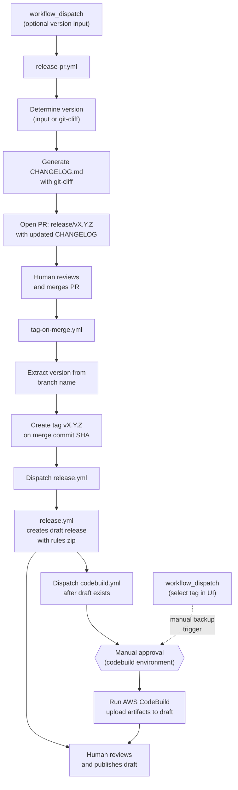
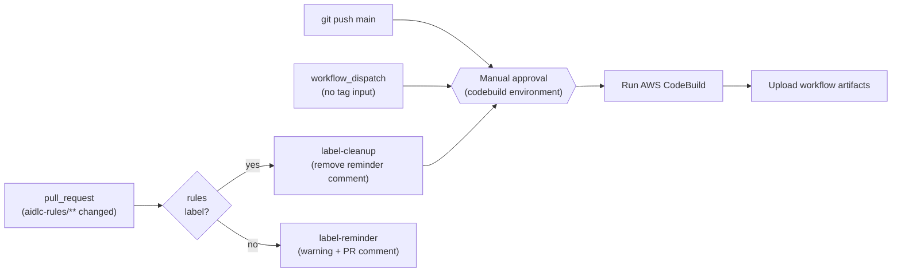
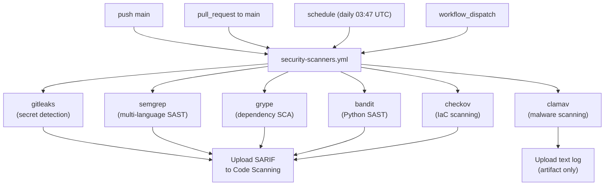
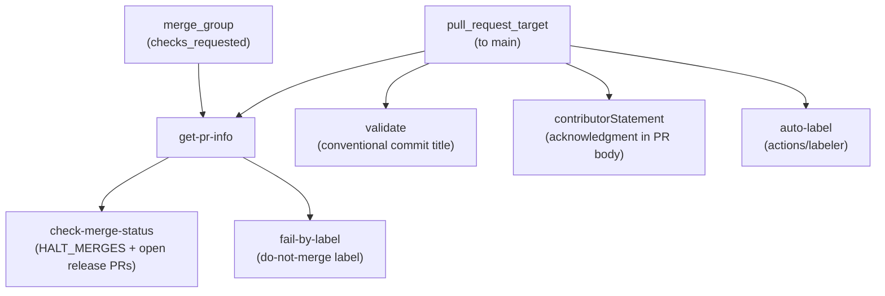

# 관리자 가이드 (Administrative Guide)

이 가이드는 `awslabs/aidlc-workflows` 저장소의 CI/CD 인프라, GitHub Workflows, 보호된 환경, 시크릿, 변수, 권한, 릴리스 절차를 문서화합니다.

**대상 독자:** 저장소 관리자, 메인테이너, 이 저장소에서 작업하는 AI 코딩 에이전트.

**관련 문서:**

- [개발자 가이드](DEVELOPERS_GUIDE.md) — 로컬 빌드 실행 (CodeBuild + `act`)
- [기여 가이드라인](../CONTRIBUTING.md) — 기여 절차 및 규약
- [README](../README.md) — 사용자 대상 셋업/사용법

---

## 목차

- [저장소 개요](#저장소-개요)
- [CI/CD 아키텍처](#cicd-아키텍처)
- [워크플로 레퍼런스](#워크플로-레퍼런스)
  - [Release PR Workflow](#release-pr-workflow-release-pryml)
  - [Tag Release Workflow](#tag-release-workflow-tag-on-mergeyml)
  - [CodeBuild Workflow](#codebuild-workflow-codebuildyml)
  - [Release Workflow](#release-workflow-releaseyml)
  - [Pull Request Validation Workflow](#pull-request-validation-workflow-pull-request-lintyml)
  - [Security Scanners Workflow](#security-scanners-workflow-security-scannersyml)
- [보호된 환경](#보호된-환경)
- [시크릿과 변수](#시크릿과-변수)
- [권한 모델](#권한-모델)
- [보안 자세](#보안-자세)
  - [보안 검출 요건](#보안-검출-요건)
- [코드 오너십](#코드-오너십)
- [릴리스 절차](#릴리스-절차)
- [Changelog 구성](#changelog-구성)
- [핀 고정 버전 업데이트](#핀-고정-버전-업데이트)

---

## 저장소 개요

이 저장소는 **AI-DLC(AI 주도 개발 생명주기)** 방법론을 `aidlc-rules/` 아래 마크다운 규칙 파일로 게시합니다. CI/CD 인프라가 처리하는 것:

- AWS CodeBuild를 통한 **지속적 통합**(평가/리포팅)
- GitHub Releases를 통한 **릴리스 배포** (zip된 규칙 파일)
- git-cliff를 통한 **Changelog 생성** (changelog-first: 릴리스 전에 업데이트되어 태그 커밋에 포함됨)

```text
awslabs/aidlc-workflows/
├── .github/
│   ├── CODEOWNERS
│   ├── ISSUE_TEMPLATE/           # 버그, 기능, RFC, 문서 템플릿
│   ├── labeler.yml               # 자동 라벨 규칙 (경로 → 라벨 매핑)
│   ├── pull_request_template.md  # 기여자 진술이 포함된 PR 템플릿
│   └── workflows/
│       ├── codebuild.yml         # AWS CodeBuild를 통한 CI
│       ├── pull-request-lint.yml # PR 검증 (제목, 라벨, 머지 게이트)
│       ├── release.yml           # 태그 푸시 시 GitHub Release
│       ├── release-pr.yml        # 릴리스 전 Changelog PR
│       ├── security-scanners.yml # 보안 스캐너 모음 (6개)
│       └── tag-on-merge.yml      # 릴리스 PR 머지 시 자동 태그
├── .claude/
│   └── settings.json             # 공유 Claude Code 프로젝트 설정
├── aidlc-rules/                  # 배포되는 산출물
│   ├── aws-aidlc-rules/          # 핵심 워크플로 규칙
│   └── aws-aidlc-rule-details/   # 단계별 상세 규칙
├── cliff.toml                    # git-cliff changelog 구성
├── docs/
│   ├── ADMINISTRATIVE_GUIDE.md   # 본 파일
│   └── DEVELOPERS_GUIDE.md       # 로컬 빌드 안내
└── scripts/
    └── aidlc-evaluator/          # 평가 프레임워크 (개발 중)
```

---

## CI/CD 아키텍처

6개의 워크플로가 두 개의 파이프라인, 보안 스캐너 모음, PR 검증 게이트를 형성합니다.

### Pipeline 1: 릴리스 (changelog-first)



릴리스 흐름은 **changelog-first** 입니다: CHANGELOG가 태그 생성 *이전*에 업데이트되어 태그 커밋이 항상 자신의 changelog 엔트리를 포함합니다. 세 가지 사람 개입 지점:

1. **릴리스 PR 머지** — changelog를 검토하고 자동 태그 부여를 트리거
2. **CodeBuild 환경 승인** — 빌드의 AWS 자격증명 접근을 게이팅
3. **드래프트 릴리스 게시** — 아티팩트 검토 후 공개로 전환

`tag-on-merge.yml`은 태그를 만든 뒤 `gh workflow run --ref vX.Y.Z`를 통해 `release.yml`과 `codebuild.yml`을 명시적으로 디스패치합니다. 디스패치는 **순차적**입니다: `release.yml`이 먼저 실행되며 완료까지 감시되어, 아티팩트가 업로드되기 전 드래프트 릴리스가 존재하도록 보장합니다. `GITHUB_TOKEN`으로 만든 태그는 `on: push: tags` 이벤트를 트리거하지 않지만, `workflow_dispatch`는 이 제한에서 자유롭기 때문입니다. 두 워크플로 모두 수동 태그 푸시의 폴백으로 `push: tags: v*`도 유지합니다. `codebuild.yml`은 빌드 진행 전 `codebuild` 보호 환경의 **수동 승인**이 필요합니다. 업로드 단계는 모든 릴리스 상태를 견고하게 처리합니다.

- **드래프트 존재 (일반 경우)** — `release.yml`이 ~30초 안에 드래프트 생성 완료. CodeBuild는 몇 분 걸리므로 아티팩트 업로드 시 드래프트는 준비된 상태
- **릴리스가 아직 없음 (codebuild가 먼저 끝남)** — 빌드 아티팩트로 드래프트 생성. 이후 `release.yml`이 업데이트
- **이미 게시됨 (재실행)** — 아티팩트 교체 시도, 불변(immutable)이면 경고

**백업 전략:** 태그 트리거 CodeBuild 실행이 실패하거나 차단되면, 관리자가 `workflow_dispatch`로 수동 디스패치하고 GitHub UI 브랜치/태그 선택기에서 `v*` 태그를 선택할 수 있습니다. `github.ref`가 선택된 태그로 해결되므로 업로드 단계가 자동 활성화됩니다.

### Pipeline 2: 지속적 통합



### Pipeline 3: 보안 스캐닝



6개의 스캐너 잡이 병렬로 실행됩니다. ClamAV를 제외한 모든 스캐너는 SARIF 리포트를 GitHub Code Scanning(Security 탭)과 다운로드 가능한 워크플로 아티팩트에 업로드합니다. 모든 스캐너는 **deferred-failure 패턴**을 사용합니다: 스캔이 끝까지 실행되고 결과가 항상 업로드된 다음, 설정된 임계값을 넘은 경우에만 잡이 실패합니다. 자세한 내용은 [Security Scanners Workflow](#security-scanners-workflow-security-scannersyml) 레퍼런스를 참고하세요.

### Pipeline 4: Pull Request 검증



`pull-request-lint.yml`은 `main`을 대상으로 한 모든 PR과 머지 큐 검사에서 실행됩니다. 네 가지 게이트(Conventional Commit PR 제목, PR 템플릿의 기여자 진술, 설정 가능한 머지 중단 메커니즘, do-not-merge 라벨 검사)를 강제하고, 변경된 파일 경로에 따라 라벨을 자동 적용합니다. 워크플로는 `pull_request_target`(즉, `pull_request`가 아님)을 사용해 베이스 브랜치 컨텍스트에서 실행됩니다 — PR 코드를 절대 체크아웃하지 않고 `auto-label` 잡이 API에서 파일 경로만 읽는 `actions/labeler`만 쓰기 때문에 안전합니다.

---

## 워크플로 레퍼런스

### Release PR Workflow (`release-pr.yml`)

| 속성              | 값                                                  |
| --------------- | ------------------------------------------------- |
| **파일**          | `.github/workflows/release-pr.yml`                |
| **트리거**         | `workflow_dispatch` (선택적 `version` 입력)        |
| **환경**          | *(없음)*                                            |
| **러너**          | `ubuntu-latest`                                   |

**목적:** git-cliff를 사용해 Conventional Commits로부터 업데이트된 `CHANGELOG.md`를 생성하고, 릴리스 버전을 `aidlc-rules/VERSION`에 기록한 뒤 `release/vX.Y.Z` 브랜치에 PR을 엽니다. changelog-first 릴리스 흐름의 첫 단계입니다. `aidlc-rules/VERSION` 업데이트는 PR이 `aidlc-rules/`를 건드리도록 하여 `codebuild.yml`의 경로 필터와 `rules` 자동 라벨을 트리거합니다.

**Job: `release-pr` ("Create Release PR")**

| 단계 | 이름                       | 액션                                                                                                                                                                                       |
| ---- | ------------------------ | ----------------------------------------------------------------------------------------------------------------------------------------------------------------------------------------- |
| 1    | Checkout code            | `actions/checkout` (`fetch-depth: 0`, git-cliff용 전체 히스토리)                                                                                                                                  |
| 2    | Install git-cliff        | `orhun/git-cliff-action`으로 CLI 사용 가능하게                                                                                                                                                  |
| 3    | Determine version        | `inputs.version`(semver 검증) 또는 `git-cliff --bumped-version` 자동 감지. 최신 태그에서 patch 범프 폴백                                                                                                |
| 4    | Check tag does not exist | 대상 태그가 이미 있으면 조기 실패                                                                                                                                                                  |
| 5    | Generate changelog       | `orhun/git-cliff-action`에 `--tag vX.Y.Z`로 `CHANGELOG.md` 생성                                                                                                                              |
| 6    | Create release PR        | 버전을 `aidlc-rules/VERSION`에 기록, 브랜치 미존재 확인, 커밋, `release/vX.Y.Z` 브랜치 푸시, 라벨(`release`, `rules`가 저장소에 존재할 경우)을 붙여 PR 오픈                                                              |

**버전 결정:** 버전이 지정되면 유효한 semver(`MAJOR.MINOR.PATCH`)여야 합니다. `v0.2.0`과 `0.2.0` 모두 허용. 지정되지 않으면 `git-cliff --bumped-version`이 Conventional Commits 프리픽스로부터 다음 버전을 결정합니다. `cliff.toml`의 `[bump]` 설정이 규칙을 제어합니다 (예: `feat` → minor, breaking change → major). Conventional Commits가 없으면 최신 태그에서 patch 범프로 폴백합니다. 태그가 전혀 없으면 경고와 함께 깔끔히 종료하고 PR을 만들지 않습니다.

**외부 액션 (SHA 고정):**

| 액션                       | 버전     | SHA                                        |
| ------------------------ | ------- | ------------------------------------------ |
| `actions/checkout`       | v6.0.1  | `8e8c483db84b4bee98b60c0593521ed34d9990e8` |
| `orhun/git-cliff-action` | v4.7.0  | `e16f179f0be49ecdfe63753837f20b9531642772` |

---

### Tag Release Workflow (`tag-on-merge.yml`)

| 속성              | 값                                                     |
| --------------- | ----------------------------------------------------- |
| **파일**          | `.github/workflows/tag-on-merge.yml`                  |
| **트리거**         | `pull_request: types: [closed]`                       |
| **조건**          | PR이 머지됨 AND 브랜치 이름이 `release/v`로 시작              |
| **환경**          | *(없음)*                                                |
| **러너**          | `ubuntu-latest`                                       |

**목적:** 릴리스 PR이 머지될 때 머지 커밋에 자동으로 버전 태그를 만들고, `release.yml`(완료 대기) 다음 `codebuild.yml`을 디스패치합니다.

**Job: `tag` ("Create Release Tag")**

| 단계 | 이름                                  | 액션                                                                                          |
| ---- | ----------------------------------- | ------------------------------------------------------------------------------------------- |
| 1    | Create tag                          | 브랜치 이름에서 버전 추출, 태그 중복 확인, GitHub API로 생성                                                       |
| 2    | Dispatch release workflow and wait  | `gh workflow run release.yml --ref $TAG --repo $REPO` 후 `gh run watch`로 완료 대기              |
| 3    | Dispatch codebuild workflow         | `gh workflow run codebuild.yml --ref $TAG --repo $REPO` (드래프트 릴리스 존재 후 실행)                |

**태그 생성:** `gh api repos/.../git/refs` 로 lightweight 태그를 만듭니다.

**Workflow dispatch:** `GITHUB_TOKEN`으로 만든 태그는 다른 워크플로의 `on: push: tags` 이벤트를 트리거하지 않습니다. 이를 우회하기 위해 `tag-on-merge.yml`은 `gh workflow run --ref $TAG`로 `release.yml`과 `codebuild.yml`을 명시 디스패치합니다. `workflow_dispatch`는 이 `GITHUB_TOKEN` 제한에서 자유롭습니다. `--ref`가 태그로 설정되므로 디스패치된 두 워크플로 모두 `github.ref = refs/tags/vX.Y.Z`를 보게 되어 실제 태그 푸시와 동일합니다. 디스패치는 **순차적**입니다: `release.yml`이 먼저 실행되고(`gh run watch`로 감시) 드래프트 릴리스가 존재한 후 `codebuild.yml`이 아티팩트 업로드를 시도합니다. 릴리스 실행을 찾을 수 없거나 실패해도 폴백으로 `codebuild.yml`은 디스패치됩니다.

**보안:** 브랜치 이름 `release/vX.Y.Z`는 명령 인젝션 방지를 위해 직접 보간이 아닌 환경 변수로 전달됩니다. 잡 수준 `if`는 `github.event.pull_request.merged == true`로 머지된 PR만 태깅을 트리거하도록 합니다.

---

### CodeBuild Workflow (`codebuild.yml`)

| 속성              | 값                                                                                                                                                                                                              |
| --------------- | --------------------------------------------------------------------------------------------------------------------------------------------------------------------------------------------------------------- |
| **파일**          | `.github/workflows/codebuild.yml`                                                                                                                                                                               |
| **트리거**         | `push` to `main`, `push` tags `v*`, `pull_request` to `main` (라벨 게이팅, 경로 필터), `workflow_dispatch` (`tag-on-merge.yml`이 디스패치 또는 수동 — UI에서 태그 선택 시 릴리스 빌드)                                                  |
| **환경**          | `codebuild` (보호됨, 수동 승인)                                                                                                                                                                                       |
| **러너**          | `ubuntu-latest`                                                                                                                                                                                                 |
| **동시 실행**       | `{workflow}-{event_name}-{ref}` 기준 그룹, 진행 중 취소                                                                                                                                                                |

**목적:** AWS CodeBuild 프로젝트를 실행하고, S3에서 주/보조 아티팩트를 다운로드해 GitHub Actions 캐시에 저장하고, 워크플로 아티팩트로 업로드합니다. `v*` 태그에서 트리거되면 GitHub Release에 첨부합니다.

**PR 라벨 게이트:** `pull_request` 이벤트의 경우 `aidlc-rules/**` 아래 파일이 변경됐을 때만(경로 필터) 워크플로가 시작되며, PR에 `rules` 라벨이 있어야만(`contains(github.event.pull_request.labels.*.name, 'rules')`) `build` 잡이 실행됩니다. `rules` 라벨은 `pull-request-lint.yml`의 `auto-label` 잡이 자동 적용합니다 ([Pull Request Validation Workflow](#pull-request-validation-workflow-pull-request-lintyml) 참고). 트리거에는 `types: [opened, synchronize, reopened, labeled]`가 포함되어 라벨 PR로의 후속 푸시가 빌드를 자동 재트리거합니다. `push`, `workflow_dispatch`, 태그 이벤트는 라벨 검사를 우회합니다.

**Job: `label-reminder`** (PR 전용, `rules` 라벨 없음)

| 단계 | 이름                                | 액션                                                                                       |
| ---- | -------------------------------- | -------------------------------------------------------------------------------------------- |
| 1    | Warn about missing rules label   | Actions 요약에 표시되는 `::warning::` 어노테이션 발신                                              |
| 2    | Comment on PR                    | 일회성 PR 코멘트 게시 (idempotent — 리마인더 코멘트가 이미 있으면 스킵)                          |

이 잡은 `aidlc-rules/**`가 변경되었지만 `rules` 라벨이 없는 `pull_request` 이벤트에서만 실행됩니다. 평가 파이프라인이 트리거되지 않았음을 메인테이너/리뷰어에게 알립니다. 코멘트는 PR당 한 번만 HTML 코멘트 마커(`<!-- rules-label-reminder -->`)로 게시되어 중복을 방지합니다. 일반 운영에서는 `pull-request-lint.yml`의 `auto-label` 잡이 `rules` 라벨을 자동 적용하므로, 이 잡은 폴백 안전망 역할을 합니다.

**Job: `label-cleanup`** (PR 전용, `rules` 라벨 존재)

| 단계 | 이름                             | 액션                                                                                       |
| ---- | ----------------------------- | ---------------------------------------------------------------------------------------- |
| 1    | Remove label reminder comment | `label-reminder` PR 코멘트를 찾아 삭제 (없으면 no-op)                                        |

`rules` 라벨이 적용되면 즉시 리마인더 코멘트를 삭제합니다. `codebuild` 환경 승인 게이트를 기다리지 않습니다.

**Job: `build`**

| 단계 | 이름                            | 조건                       | 액션                                                          |
| ---- | ---------------------------- | ------------------------- | ------------------------------------------------------------- |
| 1    | List caches                  | *(항상)*                    | `gh cache list`로 기존 프로젝트 캐시 조회                              |
| 2    | Check cache                  | *(항상)*                    | `actions/cache/restore` (`lookup-only: true`)                |
| 3    | Configure AWS credentials    | 캐시 미스                    | `aws-actions/configure-aws-credentials` (OIDC)                |
| 4    | Run CodeBuild                | 캐시 미스                    | `aws-actions/aws-codebuild-run-build` (인라인 buildspec)        |
| 5    | Build ID                     | 캐시 미스 (항상)               | CodeBuild 빌드 ID 출력                                          |
| 6    | Download CodeBuild artifacts | 캐시 미스                    | S3에서 주/보조 아티팩트 다운로드                                       |
| 7    | List CodeBuild artifacts     | 캐시 미스                    | 다운로드된 zip 파일 조회/검사                                          |
| 8    | Clean old report caches      | 캐시 미스                    | 브랜치별로 오래된 일치 캐시 3개 삭제                                  |
| 9    | Save report to cache         | 캐시 미스                    | `actions/cache/save` (키 `{project}-{branch}-{sha}`)         |
| 10   | Upload primary artifact      | `!env.ACT`                | `actions/upload-artifact` for `{project}.zip`                 |
| 11   | Upload evaluation artifact   | `!env.ACT`                | `actions/upload-artifact` for `evaluation.zip`                |
| 12   | Upload trend artifact        | `!env.ACT`                | `actions/upload-artifact` for `trend.zip`                     |
| 13   | Upload artifacts to release  | `v*` 태그에서 트리거          | GitHub Release(드래프트 또는 게시)에 빌드 아티팩트 첨부                  |

**캐싱 전략:** 캐시 키 `{project}-{branch}-{sha}` 로 같은 브랜치의 같은 커밋을 두 번 빌드하지 않습니다. 캐시 히트 시 단계 3~9는 완전히 스킵됩니다.

**인라인 buildspec:** 외부 파일을 참조하지 않고 전체 `buildspec-override`를 워크플로에 내장합니다. buildspec은:

- `gh` CLI(dnf 통해), `uv`(Python 패키지 매니저) 설치
- 빌드 컨텍스트 결정: release(태그), pre-release(기본 브랜치), pre-merge(피처 브랜치)
- `.codebuild/` 아래에 placeholder 평가/트렌드 리포트 파일 생성
- 주 아티팩트(`.codebuild/` 아래 모든 파일)와 두 보조 아티팩트(`evaluation`, `trend`)를 출력

**아티팩트 업로드 호환성:** `actions/upload-artifact` v6가 [`act`](https://github.com/nektos/act) 로컬 러너와 호환되지 않으므로 업로드 단계는 `!env.ACT`로 게이팅됩니다.

**외부 액션 (모두 SHA 고정):**

| 액션                                     | 버전     | SHA                                        |
| --------------------------------------- | ------- | ------------------------------------------ |
| `actions/cache/restore`                 | v5.0.3  | `cdf6c1fa76f9f475f3d7449005a359c84ca0f306` |
| `aws-actions/configure-aws-credentials` | v6.0.0  | `8df5847569e6427dd6c4fb1cf565c83acfa8afa7` |
| `aws-actions/aws-codebuild-run-build`   | v1.0.18 | `d8279f349f3b1b84e834c30e47c20dcb8888b7e5` |
| `actions/cache/save`                    | v5.0.3  | `cdf6c1fa76f9f475f3d7449005a359c84ca0f306` |
| `actions/upload-artifact`               | v6.0.0  | `b7c566a772e6b6bfb58ed0dc250532a479d7789f` |

---

### Release Workflow (`release.yml`)

| 속성              | 값                                                                                                                  |
| --------------- | --------------------------------------------------------------------------------------------------------------------- |
| **파일**          | `.github/workflows/release.yml`                                                                                       |
| **트리거**         | `workflow_dispatch` (`tag-on-merge.yml`이 디스패치), `push` on tags matching `v*` (수동 태그 푸시 폴백)              |
| **환경**          | *(없음)*                                                                                                              |
| **러너**          | `ubuntu-latest`                                                                                                       |

**목적:** 디스패치되거나 버전 태그가 푸시될 때 `aidlc-rules/`의 zip과 함께 **드래프트** GitHub Release를 생성합니다. CodeBuild 아티팩트가 첨부되고 검토될 수 있도록 드래프트 상태로 유지됩니다.

**Job: `release` ("Create Release")**

| 단계 | 이름                       | 조건                  | 액션                                                                                                                                                |
| ---- | ----------------------- | ----------------- | --------------------------------------------------------------------------------------------------------------------------------------------------- |
| 1    | Checkout code           | *(항상)*            | `actions/checkout` (`fetch-depth: 0`)                                                                                                              |
| 2    | Extract version         | *(항상)*            | 가드: `GITHUB_REF`가 `v*` 태그가 아니면 `::warning::` 발신하고 이후 단계 스킵. 아니면 `version`(접두 `v` 제외)과 `tag`(접두 `v` 포함)로 파싱                |
| 3    | Create release artifact | ref가 `v*` 태그   | `zip -r ai-dlc-rules-v{VERSION}.zip aidlc-rules/`                                                                                                  |
| 4    | Create GitHub Release   | ref가 `v*` 태그   | `softprops/action-gh-release` (`draft: true`, zip 첨부)                                                                                              |

**Graceful skip:** 태그가 아닌 브랜치에서 디스패치되면(예: 누가 수동으로 `main`에서 실행), 잡은 실패하지 않고 경고 어노테이션과 함께 성공으로 완료됩니다. Actions UI의 혼란스러운 빨간 X 실패를 방지합니다.

**릴리스 이름:** `AI-DLC Workflow v{VERSION}` (예: `AI-DLC Workflow v0.1.6`)

**외부 액션 (SHA 고정):**

| 액션                            | 버전     | SHA                                        |
| ----------------------------- | ------- | ------------------------------------------ |
| `actions/checkout`            | v6.0.1  | `8e8c483db84b4bee98b60c0593521ed34d9990e8` |
| `softprops/action-gh-release` | v2.5.0  | `a06a81a03ee405af7f2048a818ed3f03bbf83c7b` |

---

### Pull Request Validation Workflow (`pull-request-lint.yml`)

| 속성              | 값                                                                                                                                              |
| --------------- | ----------------------------------------------------------------------------------------------------------------------------------------------- |
| **파일**          | `.github/workflows/pull-request-lint.yml`                                                                                                       |
| **트리거**         | `pull_request_target` to `main` (edited, labeled, opened, ready_for_review, reopened, synchronize, unlabeled); `merge_group` (checks_requested) |
| **환경**          | *(없음)*                                                                                                                                          |
| **러너**          | `ubuntu-latest`                                                                                                                                 |
| **동시 실행**       | `{workflow}-{event_name}-{ref}` 기준 그룹, 진행 중 취소                                                                                                |

**목적:** 머지 전 PR을 검증합니다. Conventional Commit PR 제목, 기여자 진술, 머지 중단 제어, do-not-merge 라벨 게이트를 강제합니다. 머지 큐 검사로도 실행됩니다.

**`pull_request_target`을 사용하는 이유:** 이 트리거는 워크플로를 베이스 브랜치 컨텍스트(PR 헤드가 아님)에서 실행합니다. 본 워크플로는 어떤 단계도 PR 코드를 체크아웃/실행하지 않고 PR 메타데이터(제목, 라벨, 본문)만 검사하므로 안전합니다. `pull_request_target`을 사용하면 포크의 PR에서도 저장소 시크릿과 라벨에 접근할 수 있습니다.

**Job: `get-pr-info`**

| 단계 | 이름          | 액션                                                                                                       |
| ---- | ----------- | -------------------------------------------------------------------------------------------------------- |
| 1    | Get PR info | 이벤트 컨텍스트(`pull_request_target`) 또는 API 조회(`merge_group`)에서 PR 번호와 라벨 추출                       |

후속 잡들을 위해 `pr_number`와 `pr_labels`를 출력합니다. `merge_group` 이벤트에서는 ref 이름에서 PR 번호를 추출하고 라벨은 GitHub API로 가져옵니다. `pull_request_target` 이벤트에서는 이벤트 페이로드에서 직접 가져옵니다.

**Job: `check-merge-status` ("Check Merge Status")**

`get-pr-info`에 의존. 상류 잡이 실패해도 `if: always()`로 실행됩니다.

| 검사                    | 동작                                                                            |
| -------------------- | ----------------------------------------------------------------------------- |
| Open release PRs     | 다른 `release/` PR이 열려 있으면 머지 차단 (동시 릴리스 방지)                                     |
| `HALT_MERGES = 0`    | 모든 머지 허용 (기본값)                                                                |
| `HALT_MERGES = -N`   | 모든 머지 차단                                                                       |
| `HALT_MERGES = N`    | PR #N 만 머지 허용                                                                  |

**Job: `fail-by-label` ("Fail by Label")**

`get-pr-info`에 의존. `if: always()`. PR에 `do-not-merge` 라벨(`DO_NOT_MERGE_LABEL` 변수로 설정 가능)이 있으면 검사를 실패시킵니다.

**Job: `validate` ("Validate PR title")**

`pull_request`와 `pull_request_target` 이벤트에서만 실행 (`merge_group`은 아님). `amannn/action-semantic-pull-request`로 PR 제목에 Conventional Commits 형식을 강제합니다.

허용 타입: `fix`, `feat`, `build`, `chore`, `ci`, `docs`, `style`, `refactor`, `perf`, `test`. 스코프는 선택 (`requireScope: false`).

**Job: `auto-label` ("Auto-label")**

`pull_request_target` 이벤트에서만 실행. [`actions/labeler`](https://github.com/actions/labeler) v6.0.1을 사용해 변경된 파일 경로에 따라 라벨을 자동 적용/제거합니다. 라벨 규칙은 `.github/labeler.yml`에 정의됩니다.

| 라벨               | 경로 패턴                                          | 설명                                                |
| --------------- | ----------------------------------------------- | ------------------------------------------------- |
| `rules`         | `aidlc-rules/**`                                | CodeBuild 평가 파이프라인 트리거                              |
| `documentation` | `**/*.md` (`aidlc-rules/**` 제외)                 | 규칙이 아닌 마크다운 파일 변경                                 |
| `github`        | `.github/**`                                    | 워크플로, 템플릿, 구성 변경                                   |

`sync-labels: true`로 PR diff에서 매칭 파일이 사라지면(예: rebase 후) 라벨이 자동 제거됩니다. 새 라벨 규칙은 `.github/labeler.yml`을 편집해 추가 가능하며 워크플로 변경 불필요합니다.

**Job: `contributorStatement` ("Require Contributor Statement")**

`pull_request`와 `pull_request_target` 이벤트에서만 실행. 봇 계정(`dependabot[bot]`, `github-actions[bot]`, `github-actions`, `aidlc-workflows`)은 스킵. PR 본문에 `.github/pull_request_template.md`의 기여자 진술이 포함되어 있는지 확인.

> By submitting this pull request, I confirm that you can use, modify, copy, and redistribute this contribution, under the terms of the project license.

**외부 액션 (SHA 고정):**

| 액션                                       | 버전     | SHA                                        |
| --------------------------------------- | ------- | ------------------------------------------ |
| `actions/labeler`                       | v6.0.1  | `634933edcd8ababfe52f92936142cc22ac488b1b` |
| `amannn/action-semantic-pull-request`   | v6.1.1  | `48f256284bd46cdaab1048c3721360e808335d50` |
| `actions/github-script`                 | v8.0.0  | `ed597411d8f924073f98dfc5c65a23a2325f34cd` |

---

### Security Scanners Workflow (`security-scanners.yml`)

| 속성              | 값                                                                                              |
| --------------- | ---------------------------------------------------------------------------------------------- |
| **파일**          | `.github/workflows/security-scanners.yml`                                                      |
| **트리거**         | `push` to `main`, `pull_request` to `main`, `schedule` (매일 03:47 UTC), `workflow_dispatch`     |
| **환경**          | *(없음)*                                                                                          |
| **러너**          | `ubuntu-latest`                                                                                |
| **동시 실행**       | `{workflow}-{event_name}-{ref}` 기준 그룹, 진행 중 취소                                                  |

**목적:** 6개의 독립 보안 스캐너를 병렬 실행하여 시크릿, 취약점, 잘못된 설정, 멀웨어를 탐지합니다. 모든 HIGH 및 CRITICAL 검출은 머지 전에 조치되거나 문서화된 위험 수용이 있어야 합니다 ([보안 검출 요건](#보안-검출-요건) 참고).

**권한 모델:** 워크플로 수준에서 deny-all, 각 잡에 `actions: read`, `contents: read`, `security-events: write`만 부여.

**Jobs:**

| 잡           | 스캐너     | 탐지 대상                                            | 실패 조건                                                       |
| ---------- | -------- | --------------------------------------------------- | ------------------------------------------------------------ |
| `gitleaks` | Gitleaks | git 이력의 시크릿                                       | `.gitleaks-baseline.json`에 없는 모든 시크릿                       |
| `semgrep`  | Semgrep  | 보안 안티패턴 (모든 언어)                                  | 모든 검출 (PR은 `--baseline-commit` 통해 신규만)                    |
| `grype`    | Grype    | 의존성의 알려진 CVE                                      | high 또는 critical CVE (`fail-on-severity: high`)             |
| `bandit`   | Bandit   | Python 보안 이슈                                       | high confidence 검출                                          |
| `checkov`  | Checkov  | IaC 잘못된 설정 (GitHub Actions, Dockerfile)            | 모든 체크 실패 (skip 제외)                                       |
| `clamav`   | ClamAV   | 멀웨어, 바이러스                                          | 모든 탐지                                                       |

**Deferred-failure 패턴:** 모든 스캐너는 단계를 실패시키지 않고(`set +e`) 종료 코드를 캡처한 뒤 SARIF 리포트를 아티팩트와 GitHub Code Scanning에 업로드하고, 검출이 있으면 잡을 실패시킵니다. 결과는 항상 보존됩니다. ClamAV는 동일 패턴이지만 SARIF가 아닌 텍스트 로그를 업로드합니다.

**설정 파일:**

| 파일                         | 목적                                              |
| ------------------------- | ---------------------------------------------- |
| `.bandit`                 | Bandit 대상, 제외, confidence 레벨                    |
| `.semgrepignore`          | Semgrep 경로 제외                                   |
| `.gitleaks.toml`          | Gitleaks 규칙 확장 및 경로 허용 목록                       |
| `.gitleaks-baseline.json` | 사전 알려진 검출 (테스트 자격증명)                              |
| `.grype.yaml`             | Grype 심각도 임계 및 CVE 무시 목록                         |
| `.checkov.yaml`           | Checkov 프레임워크와 skip 체크                         |

**버전 고정:** 모든 스캐너 도구 버전과 GitHub Actions는 워크플로 파일에 특정 버전 또는 커밋 SHA로 고정되어 재현 가능한 빌드와 공급망 공격 방지를 보장합니다. 적어도 분기마다 검토·업데이트해야 합니다. 업데이트 절차는 [핀 고정 버전 업데이트](#핀-고정-버전-업데이트)를 참고하세요.

자세한 조치/억제 가이드는 [개발자 가이드 — 보안 스캐너](DEVELOPERS_GUIDE.md#security-scanners)를 참고하세요.

---

## 보호된 환경

| 환경         | 사용처                          | 목적                                                |
| ----------- | --------------------------- | --------------------------------------------------- |
| `codebuild` | `codebuild.yml` 잡 `build`     | CodeBuild의 AWS 자격증명 접근 게이팅                  |

`codebuild` 환경이 유일한 보호 환경입니다. 다음을 포함합니다.

- `AWS_CODEBUILD_ROLE_ARN` 시크릿 (OIDC 기반 AWS 역할 가정에 필요)
- 저장소 변수 `CODEBUILD_PROJECT_NAME`, `AWS_REGION`, `ROLE_DURATION_SECONDS` 가 여기 있을 수 있음 (또는 저장소 수준에 설정 가능)

환경 보호 규칙(GitHub 저장소 설정에서 구성)에는 필수 리뷰어, 배포 브랜치 제한이 포함될 수 있습니다.

---

## 시크릿과 변수

### 시크릿

| 시크릿                       | 범위                          | 사용처                                                                          | 목적                                                                                                            |
| ------------------------ | --------------------------- | ---------------------------------------------------------------------------- | ------------------------------------------------------------------------------------------------------------- |
| `AWS_CODEBUILD_ROLE_ARN` | 환경 (`codebuild`)            | `codebuild.yml`                                                              | OIDC 기반 AWS STS 역할 가정용 IAM Role ARN                                                                          |
| `GITHUB_TOKEN`           | 자동 (GitHub 제공)              | `release.yml`, `release-pr.yml`, `tag-on-merge.yml`, `pull-request-lint.yml` | GitHub API 호출 인증 (릴리스 생성, PR 생성, 태그 생성, 워크플로 디스패치, PR 검증)                            |

`codebuild.yml` 워크플로는 `github.token` (자동 토큰, `secrets.` 접두 없이 접근)도 캐시 관리와 릴리스 자산 업로드에 사용합니다.

### 저장소 변수

| 변수                        | 사용처                       | 기본 폴백                | 목적                                                          |
| ------------------------- | ----------------------- | ------------------- | ---------------------------------------------------------------- |
| `CODEBUILD_PROJECT_NAME`  | `codebuild.yml`         | `codebuild-project` | AWS CodeBuild 프로젝트명                                      |
| `AWS_REGION`              | `codebuild.yml`         | `us-east-1`         | CodeBuild와 STS의 AWS 리전                                    |
| `ROLE_DURATION_SECONDS`   | `codebuild.yml`         | `7200`              | STS 세션 지속 시간(초)                                       |
| `DO_NOT_MERGE_LABEL`      | `pull-request-lint.yml` | `do-not-merge`      | PR 머지를 차단하는 라벨 이름                                          |
| `HALT_MERGES`             | `pull-request-lint.yml` | `0`                 | 머지 게이트: `0`=모두 허용, `-N`=모두 차단, `N`=PR #N만 허용 |

모든 변수는 `${{ vars.VAR || 'default' }}` 구문으로 합리적 기본값이 있어 명시 설정이 없어도 워크플로가 동작합니다.

---

## 권한 모델

### 워크플로 수준 권한

| 워크플로                  | 권한                                       |
| ------------------------- | ----------------------------------------- |
| `codebuild.yml`           | 16개 스코프 모두 명시적으로 `none`            |
| `pull-request-lint.yml`   | 16개 스코프 모두 명시적으로 `none`            |
| `release.yml`             | 16개 스코프 모두 명시적으로 `none`            |
| `release-pr.yml`          | 16개 스코프 모두 명시적으로 `none`            |
| `security-scanners.yml`   | 16개 스코프 모두 명시적으로 `none`            |
| `tag-on-merge.yml`        | 16개 스코프 모두 명시적으로 `none`            |

### 잡 수준 권한 (오버라이드)

| 워크플로                  | 잡                       | 권한                                                       | 근거                                                                                                          |
| ----------------------- | ---------------------- | --------------------------------------------------------- | ------------------------------------------------------------------------------------------------------------ |
| `codebuild.yml`         | `label-reminder`       | `pull-requests: write`                                    | `rules` 라벨이 없을 때 리마인더 코멘트 게시                                                                  |
| `codebuild.yml`         | `label-cleanup`        | `pull-requests: write`                                    | `rules` 라벨이 적용되면 리마인더 코멘트 삭제                                                                |
| `codebuild.yml`         | `build`                | `actions: write`, `contents: write`, `id-token: write`    | 캐시 관리, 릴리스 자산 업로드, AWS STS용 OIDC 토큰                                                            |
| `pull-request-lint.yml` | `auto-label`           | `contents: read`, `issues: write`, `pull-requests: write` | 변경 파일 경로에 따라 라벨 적용/제거. `issues: write`로 아직 없는 라벨 생성 가능                              |
| `pull-request-lint.yml` | `get-pr-info`          | `contents: read`, `pull-requests: read`                   | API로 PR 메타데이터/라벨 읽기                                                                                |
| `pull-request-lint.yml` | `check-merge-status`   | `pull-requests: read`                                     | 머지 게이트 체크를 위한 PR 상태 읽기                                                                          |
| `pull-request-lint.yml` | `validate`             | `pull-requests: read`                                     | Conventional Commits 검증을 위한 PR 제목 읽기                                                                |
| `pull-request-lint.yml` | `contributorStatement` | `pull-requests: read`                                     | 기여자 진술 확인용 PR 본문 읽기                                                                              |
| `release.yml`           | `release`              | `contents: write`                                         | 드래프트 릴리스 생성 및 zip 첨부                                                                              |
| `release-pr.yml`        | `release-pr`           | `contents: write`, `pull-requests: write`                 | changelog 생성, 브랜치 푸시, PR 오픈                                                                          |
| `tag-on-merge.yml`      | `tag`                  | `contents: write`, `actions: write`                       | API로 태그 생성, release/codebuild 워크플로 디스패치                                                          |

6개 워크플로 모두 **deny-all-then-grant** 패턴을 따릅니다: 모든 권한 스코프는 워크플로 수준에서 `none`으로 설정되고, 잡 수준에서 필요한 스코프만 부여됩니다. 가장 엄격한 구성이며 손상된 단계로부터의 권한 상승을 방지합니다. `security-scanners.yml`은 6개의 각 잡에 `actions: read`, `contents: read`, `security-events: write`를 부여합니다.

---

## 보안 자세

| 통제                      | 구현                                                                                                                                                                                                                                                  |
| --------------------------- | ------------------------------------------------------------------------------------------------------------------------------------------------------------------------------------------------------------------------------------------------------- |
| **공급망 보호**            | 모든 외부 액션은 가변 버전 태그가 아닌 전체 커밋 SHA에 고정                                                                                                                                                                              |
| **AWS 인증**             | `id-token: write`를 통한 OIDC 기반 역할 가정 — 정적 자격증명 저장 없음                                                                                                                                                                                  |
| **최소 권한 토큰**      | 6개 워크플로 모두 워크플로 수준에서 16개 권한 스코프를 명시적으로 거부, 잡 수준에서 필요한 스코프만 부여                                                                                                                                                                |
| **환경 보호**       | `codebuild` 환경이 잠재적 리뷰어/브랜치 규칙과 함께 AWS 자격증명 접근을 게이팅                                                                                                                                                                       |
| **보안 스캐닝**         | 6개의 자동 스캐너(SAST, SCA, 시크릿, IaC, 멀웨어)가 `main` 푸시, 모든 PR, 매일 실행. 검출은 GitHub Code Scanning에 게시. 모든 HIGH/CRITICAL은 조치 또는 문서화된 위험 수용 필요                                  |
| **라벨 게이팅 CI**        | `codebuild.yml`은 PR에 `rules` 라벨을 요구하며 `aidlc-rules/**` 변경 시에만 트리거. 불필요한 빌드와 환경 승인 요청을 방지. 라벨은 `pull-request-lint.yml`의 `auto-label` 잡이 자동 적용 |
| **동시 실행 제어**       | `codebuild.yml`, `pull-request-lint.yml`, `security-scanners.yml`은 같은 브랜치의 진행 중 실행을 취소                                                                                                                                       |
| **안전한 PR 트리거**          | `pull-request-lint.yml`은 `pull_request_target`을 사용하지만 PR 코드를 절대 체크아웃하지 않고 메타데이터(제목, 라벨, 본문)만 검사                                                                                                                          |
| **인젝션 안전 입력**   | `run:` 블록에서 `${{ }}` 표현식 보간 0건 — 모든 동적 값(`github.ref_name`, `github.repository`, `env.*`, 이벤트 입력)은 단계 수준 `env:` 또는 자동 export된 워크플로 `env:` 변수로 전달                                    |
| **코드 오너십**         | `.github/`(워크플로 포함)는 CODEOWNERS를 통해 `@awslabs/aidlc-admins`가 단독 소유                                                                                                                                                            |
| **계정 마스킹**         | AWS 자격증명 구성에서 `mask-aws-account-id: true`                                                                                                                                                                                             |

### 보안 검출 요건

모든 스캐너의 **HIGH** 및 **CRITICAL** 보안 검출은 PR을 `main`에 머지하기 전에 **조치되거나** **문서화된 위험 수용**이 있어야 합니다. 적용 대상:

- **Bandit / Semgrep (SAST):** high-severity 코드 검출은 수정 또는 해당 검출이 수용 가능한 사유를 설명하는 인라인 코멘트(`# nosec` / `# nosemgrep`)로 억제
- **Grype (SCA):** high/critical CVE는 영향 의존성 업그레이드로 해결. 수정이 없으면 `.grype.yaml` `ignore`에 CVE, 영향 패키지, 수용 사유 추가
- **Gitleaks (시크릿):** 검출된 시크릿은 즉시 회전. 합성/테스트 자격증명만 베이스라인(`.gitleaks-baseline.json`)에 추가 가능
- **Checkov (IaC):** 실패하는 체크는 수정 또는 사유와 함께 `# checkov:skip=` 인라인 코멘트로 억제, 또는 코멘트와 함께 `.checkov.yaml` `skip-check`에 추가
- **ClamAV (멀웨어):** 검출은 조사 후 파일 제거. 억제 메커니즘 없음

**위험 수용 절차:**

1. 개발자가 명확한 정당성과 함께 적절한 억제(인라인 코멘트 또는 구성 엔트리)를 추가
2. 일반 PR 코드 리뷰의 일부로 억제를 검토
3. `@awslabs/aidlc-admins` 또는 `@awslabs/aidlc-maintainers`의 리뷰어가 위험 수용을 승인해야 함
4. LOW와 MEDIUM 검출은 가능한 시점에 처리되어야 하지만 머지를 차단하지는 않음

스캐너별 상세 조치/억제 가이드는 [개발자 가이드 — 보안 스캐너](DEVELOPERS_GUIDE.md#security-scanners)를 참고하세요.

---

## 코드 오너십

`.github/CODEOWNERS`에 정의:

| 경로                                            | 오너                                                                              |
| --------------------------------------------- | ----------------------------------------------------------------------------- |
| `*` (기본)                                      | `@awslabs/aidlc-admins` `@awslabs/aidlc-maintainers`                          |
| `.github/`                                    | `@awslabs/aidlc-admins`                                                       |
| `.github/CODEOWNERS`                          | `@awslabs/aidlc-admins`                                                       |
| `aidlc-rules/`                                | `@awslabs/aidlc-admins` `@awslabs/aidlc-maintainers` `@awslabs/aidlc-writers` |
| `assets/`                                     | `@awslabs/aidlc-admins` `@awslabs/aidlc-maintainers` `@awslabs/aidlc-writers` |
| `scripts/`                                    | `@awslabs/aidlc-admins` `@awslabs/aidlc-maintainers`                          |
| `CHANGELOG.md`, `cliff.toml`, `LICENSE` 등 | `@awslabs/aidlc-admins`                                                       |

**핵심 함의:** `.github/`(워크플로, CODEOWNERS, 이슈 템플릿) 변경은 `@awslabs/aidlc-admins`만 승인할 수 있습니다.

---

## 릴리스 절차

릴리스는 **changelog-first** 흐름을 따릅니다: CHANGELOG가 태그 생성 *전*에 업데이트되어 태그 커밋이 항상 자신의 changelog 엔트리를 포함합니다. 세 가지 사람 개입 지점(PR 머지, CodeBuild 승인, 릴리스 게시).

1. GitHub Actions UI에서 **Release PR 워크플로 디스패치**:
   - Actions → Release PR → Run workflow
   - 선택적으로 버전 지정 (예: `0.2.0`); Conventional Commits에서 자동 결정하려면 비워두기
   - `release-pr.yml`이 `CHANGELOG.md`를 생성하고, `aidlc-rules/VERSION`에 버전을 기록하며, 라벨 `release`, `rules`와 함께 `release/v1.2.0` 브랜치에 PR을 엽니다

2. **릴리스 PR 검토 및 머지:**
   - changelog 내용 정확성 확인
   - PR 머지 (`CHANGELOG.md`가 `@awslabs/aidlc-admins` 소유이므로 그들의 승인 필요)
   - `tag-on-merge.yml`이 머지 커밋에 `v1.2.0` 태그를 자동 생성하고 release/build 워크플로를 디스패치

3. **`release.yml`이 자동 실행** (`tag-on-merge.yml`이 `--ref v1.2.0`으로 디스패치):
   - `aidlc-rules/`를 `ai-dlc-rules-v1.2.0.zip`으로 압축
   - "AI-DLC Workflow v1.2.0" 이름의 **드래프트** GitHub Release 생성, zip 첨부

4. **`codebuild.yml`이 자동 실행** (`tag-on-merge.yml`이 디스패치; `codebuild` 환경 승인 필요):
   - 태그 커밋에 대해 CodeBuild 실행
   - 빌드 아티팩트(주, 평가, 트렌드) 다운로드
   - 드래프트 릴리스에 아티팩트 첨부 (드래프트가 없으면 생성)

5. GitHub UI에서 "Publish release"를 클릭해 **릴리스 게시**:
   - 모든 기대 아티팩트(rules zip + 빌드 아티팩트) 첨부 확인
   - 릴리스 노트 검토 및 필요 시 편집

**참고:** 태그 트리거 빌드를 위해 `codebuild` 보호 환경의 배포 브랜치 규칙이 `main` 외에 `v*` 태그도 허용하도록 업데이트가 필요할 수 있습니다.

---

## Changelog 구성

`cliff.toml`에 정의 (`release-pr.yml`이 사용):

| 설정                  | 값                                                  |
| ----------------- | ----------------------------------------------------- |
| **커밋 형식**     | Conventional Commits (`feat:`, `fix:`, `docs:` 등) |
| **태그 패턴**     | `v[0-9].*`                                            |
| **정렬 순서**     | 오래된 것 먼저                                          |

**커밋 그룹:**

| 프리픽스    | 그룹 이름     |
| ---------- | ------------- |
| `feat`     | Features      |
| `fix`      | Bug Fixes     |
| `docs`     | Documentation |
| `perf`     | Performance   |
| `refactor` | Refactoring   |
| `style`    | Style         |
| `test`     | Tests         |
| `build`    | CI/CD         |
| `ci`       | CI/CD         |
| `chore`    | Miscellaneous |

**필터링 커밋:**

| 패턴                       | 동작                                            |
| ------------------------ | ------------------------------------------ |
| `docs: update changelog` | 스킵 (이전 릴리스 흐름의 잡음) |

Conventional이 아닌 커밋은 필터링됩니다(`filter_unconventional = true`).

**버전 범프 규칙** (`[bump]` 섹션):

| 규칙                                    | 효과                                                  |
| ----------------------------------- | --------------------------------------------- |
| `features_always_bump_minor = true` | `feat:` 커밋은 minor 범프 트리거                       |
| `breaking_always_bump_major = true` | breaking change는 major 범프 트리거                   |

이 규칙들은 `release-pr.yml`에서 다음 버전을 자동 결정할 때 `git-cliff --bumped-version`이 사용합니다.

---

## 핀 고정 버전 업데이트

워크플로 파일의 모든 스캐너 도구, GitHub Actions, 컨테이너 이미지는 특정 버전 또는 커밋 SHA에 고정됩니다. 공급망 공격을 방지하고 재현 가능한 빌드를 보장하지만, 보안 패치와 새 기능을 따라가기 위해 주기적인 유지보수가 필요합니다.

핀 고정 버전은 **적어도 분기마다** 검토·업데이트해야 합니다.

<!-- TODO: 핀 버전 업데이트에 대한 단계별 안내 추가:
  - 각 스캐너 도구의 최신 버전 확인 방법 (PyPI, GitHub releases, Docker Hub)
  - GitHub Actions의 커밋 SHA 조회 방법 (gh api repos/OWNER/REPO/git/ref/tags/TAG)
  - Docker 이미지 다이제스트 조회 방법 (docker manifest inspect)
  - 업데이트 검증 방법 (피처 브랜치에서 워크플로 실행)
  - 스캐너 도구 업그레이드의 breaking change 처리 방법
  - Dependabot 또는 Renovate로 자동화 고려
-->

에이전트 사전 커밋 체크리스트 (권장):

- npx markdownlint-cli2 --fix "**/*.md"  # 마크다운 린트 자동 수정
- npx markdownlint-cli2 "**/*.md"    # 린트 오류 없음 확인
- uv run pytest                            # uv 래퍼로 테스트 실행

에이전트는 변경을 커밋·푸시하기 전에 위 체크리스트를 실행하고 모든 검사를 통과시켜야 합니다.
