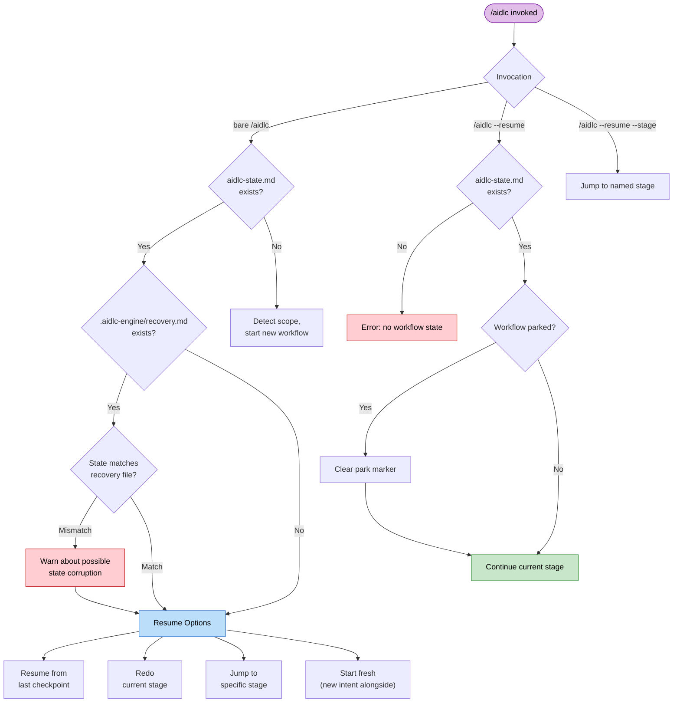

# Session Management

A workflow may span multiple harness sessions. AI-DLC persists all progress to disk so you can resume, redo, jump, or start fresh at any time.

> **Harness note.** Session resume works on every harness (the state lives in
> the intent's record dir, not the harness). Session *lifecycle events* differ: Claude Code
> emits `SESSION_STARTED/RESUMED/ENDED` and `SESSION_COMPACTED`; Kiro CLI emits
> only `SESSION_STARTED`; Kiro IDE emits `SESSION_STARTED`, and `SESSION_RESUMED`
> when a prompt returns to an earlier chat; Codex infers `SESSION_ENDED`, then
> re-injects the mission through compact-source `SessionStart`. See [Running on other harnesses](harnesses/README.md).

---

## Resume Flow

When you run bare `/aidlc` in a new session and the active intent's `aidlc-state.md` exists, AI-DLC presents a status summary and offers four resume options. Run `/aidlc --resume` when you already know you want to continue from the saved checkpoint; it skips the menu and routes directly to the current stage.



<!-- Text fallback: bare /aidlc with state checks the recovery breadcrumb and shows four resume options; without state it starts scope detection. /aidlc --resume with state clears a park marker if needed and continues directly; without state it errors. /aidlc --resume --stage jumps to the named stage. -->

Park from the command surface with `/aidlc park`; the engine names the park command and the conductor reports where it stopped. `/aidlc --resume` brings it back.

### Four resume options

| Option | What happens | What is preserved | What is lost |
|--------|-------------|-------------------|-------------|
| **Resume from last checkpoint** | Continue from the in-progress or next pending stage. Task sidebar is rebuilt from the state file. | All artifacts, state, audit trail | In-memory conversation context from the prior session |
| **Redo current stage** | Reset the current stage's checkbox (via `aidlc-jump.ts execute --direction redo`) and re-execute it from scratch. When Construction runs one Unit at a time and a Unit has finished work, Redo instead redoes only the active Unit's step, also when that Unit is waiting for its summary confirmation or checkpoint approval. | All other artifacts and state (and, one Unit at a time, the other Units' finished work) | Current stage's completion status and partial work (one Unit at a time: that Unit's step) |
| **Jump to stage** | Skip to a specific stage (via `next --stage <slug>`). Warns about skipped stages and potential downstream artifact invalidation. | All existing artifacts | Stages between current and target are marked `[S]` (skipped) |
| **Start fresh** | Start a new intent alongside the existing one (via `next --new-intent`, after confirming scope and description). | The existing workflow's artifacts, state, and audit trail (it stays in place) | Nothing - the prior intent remains resumable |

`/aidlc --resume --stage <slug>` treats the explicit stage as the target and takes the normal jump path.

Dispatched ensemble work resumes from evidence on disk. For Practices
Discovery, the conductor preserves the lead draft and every existing
contribution file, dispatches only the missing quality/developer/devsecops
spokes, then continues with the human interview and lead integration. It does
not repeat completed spokes.

Code Generation resumes from the plan's ticks. The developer agent ticks each
step in `code-generation-plan.md` as it finishes it. If the build stops part
way (a model or provider error, the editor closed), the next run of the same
approved plan picks up at the first unticked step, and you see one line such as
"Picking up unit-2's code at step 5 of 9 (1-4 done; redoing 3, its files were
missing)." A ticked step whose named files are no longer on disk is redone.
Redo, Request Changes, and approving the plan again start its steps fresh: the
plan's ticks are cleared when the new build starts, and only the ticks it makes
count if it is cut off in turn. Editing the plan after approval also starts
fresh.

---

## Recovery Breadcrumb

Before Claude Code compacts conversation context, the `validate-state.ts` hook writes a hidden recovery file at `.aidlc-engine/recovery.md` in the active intent's record dir. This file contains:

- Timestamp of the last validation
- Current stage name (extracted from `aidlc-state.md`)
- State file validity status

On the next `/aidlc` invocation, AI-DLC compares `.aidlc-engine/recovery.md` against `aidlc-state.md`. If the "Current stage" fields differ, it warns you about possible state corruption from context compaction.

---

## Context Compaction

Claude Code automatically summarizes earlier conversation context when the context window fills up. This is called **compaction**. This implementation has safeguards to preserve workflow state across compaction events.

### What is preserved vs. lost

| Preserved | Lost |
|-----------|------|
| All record-dir artifacts (files on disk) | In-memory conversation context (prior discussion) |
| `aidlc-state.md` (stage progress, scope, project info) | Partial in-progress work not yet written to files |
| `audit/` shards (full history of decisions and actions) | Task IDs (rebuilt from state file on resume) |
| `.aidlc-engine/recovery.md` (stage checkpoint) | Agent persona context (reloaded from agent files) |

### How to recover after compaction

1. Run `/aidlc` — AI-DLC reads the state file and offers resume options
2. If the recovery breadcrumb warns about a mismatch, choose **Redo current stage** to re-execute the stage that was in progress during compaction. When Construction runs one Unit at a time, the resume context names the step the active Unit is on (for example `Current Step: code-generation for unit beta`), and Redo redoes only that Unit's step; the other Units' finished work stays approved
3. If no warning appears, choose **Resume from last checkpoint** to continue normally

Compaction is a normal part of long sessions. The state file and artifacts on disk ensure no completed work is lost.

---

## Stage Jumps

You can jump forward or backward in the workflow using utility commands.

### Jump to a specific stage

```
/aidlc --stage code-generation
/aidlc --stage 3.5
```

When jumping forward, stages between the current position and the target are marked `[S]` (skipped). The orchestrator warns you about:

- Stages that will be skipped
- Artifacts that downstream stages may expect but will not find
- Potential impact on traceability

When Construction runs one Unit at a time (unit-major, the default for new work), a jump goes through when you ask for it. Jumping to the step the active Unit is on simply continues it. Jumping back to a step the active Unit already finished, for example `/aidlc --stage nfr-design` while unit beta is on Code Generation, reopens it and the steps after it for that Unit only (each reopened step that finds its earlier files offers Keep, Modify, or Redo), and the assistant says so in one line: "Reopened NFR Design for unit beta. alpha keeps its finished work. Say 'for every unit' to redo it for alpha too." Saying "for every unit", or naming a Unit, reopens it for those Units instead, also after the stage approvals have moved on to a later per-unit step. Naming another Unit while beta is in the middle of a step pauses beta's step first, and the assistant says: "Paused unit beta at Code Generation and reopened NFR Design for unit alpha. Say 'back to beta' to pick beta up again." Nothing is lost: alpha redoes its steps, then beta picks up where it stopped, or earlier when you say 'back to beta'. Naming a Unit where that cannot apply (a step that is not done per Unit, or, with Construction checkpoints off, a step already approved for every Unit) is said plainly and nothing changes; saying "for every unit" then reopens it for every Unit. Jumping further, for example `/aidlc --phase operation` to leave Construction early, skips the steps Units have not finished (their files stay), and a target inside the per-unit steps also starts over what Units finished from there on. The assistant tells you in one line what was skipped and that `/aidlc --stage <earliest skipped step>` reopens it.

When jumping backward, the target stage and every later stage in your plan are reset to `[ ]` (not started) and come up again in order. A jump resets progress marks, not files: the artifacts stay on disk, and each reopened stage that finds its earlier files asks whether to keep, modify, or redo them.

### Jump to the start of a phase

```
/aidlc --phase construction
/aidlc --phase 3
```

This jumps to the first stage of the specified phase. The same warnings about skipped stages and artifact invalidation apply.

### Combining jumps with scope

For projects without a state file, you can combine `--stage` or `--phase` with `--scope`:

```
/aidlc --stage code-generation --scope bugfix
```

This creates a new workflow with the specified scope and jumps directly to the target stage.

---

## Session Skills

Three read-only skills report on the current workflow without changing it. Each is typed like a command and appears in the `/` skill picker:

| Skill | What it does | Output |
|-------|--------------|--------|
| `/aidlc-session-cost` | Prints a deterministic cost view — duration, stage outcomes, memory entries, sensor firings, learnings captured | Terminal only |
| `/aidlc-replay` | Renders a readable session narrative for stakeholders who weren't in the room — what was decided and why | Terminal only |
| `/aidlc-outcomes-pack` | Generates a handover document so the team can own and continue the system without re-running the workflow | Writes `OUTCOMES.md` |

**They are read-only.** None advances the workflow stage pointer, and none emits an audit event, so they are safe to run at any point — including mid-stage. `/aidlc-session-cost` and `/aidlc-replay` print to the terminal and write nothing; `/aidlc-outcomes-pack` is the only one that writes a file (`OUTCOMES.md` at the workspace root).

**Every number they report comes straight from the data plane.** Each skill reads its figures from `aidlc engine runtime summary --json` — the materialised view over `runtime-graph.json`. The skills never estimate or recount; the prose around the numbers (the narrative, the decision rationale) is the only part synthesised from the audit trail and artefacts. There is deliberately no token estimate — the old file-size-to-token heuristic was guesswork and has been removed.

```
/aidlc-session-cost      # quick "where are we" snapshot, any time
/aidlc-replay            # narrate the session for async review
/aidlc-outcomes-pack     # at workflow close — write the handover doc
```

Each skill needs a compiled `runtime-graph.json` to read. If you run one before a workflow has started its first stage, it prints a short "no session data yet" note and stops.

**If your harness doesn't expose the slash command.** `/aidlc-session-cost`, `/aidlc-replay`, and `/aidlc-outcomes-pack` are skills — they only appear as typeable commands in harnesses that surface skills in the `/` picker (Claude Code, Kiro, Cursor, and the like). On a harness that doesn't, typing `/aidlc-session-cost` is reported as an invalid command. The cost view still works: run the underlying command directly, which is exactly what the skill runs and what every number comes from:

```bash
aidlc engine runtime summary          # human-readable cost view
aidlc engine runtime summary --json   # machine-readable, same numbers
```

This is read-only and safe to run at any point in a workflow. Like the skills, it needs a compiled `runtime-graph.json`; before the first stage transition it exits non-zero with a "run a workflow first" note.

---

## Next Steps

- [State Tracking and Audit Trail](10-state-and-audit.md) — State file structure and checkpoint notation
- [Skills and Runner Commands](17-skills.md) — The read-only session views (`/aidlc-session-cost`, `/aidlc-replay`, `/aidlc-outcomes-pack`) and the runner family
- [CLI Commands](12-cli-commands.md) — Full reference for `--stage`, `--phase`, and other flags
- [Troubleshooting](15-troubleshooting.md) — Compaction recovery and state corruption
- [Glossary](glossary.md) — Definitions for compaction, recovery breadcrumb, session
