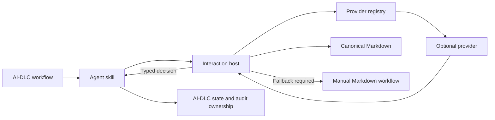

# RFC 0001: Agent-Agnostic Interactive Capability

- **Status:** Prototype
- **Target:** AI-DLC v2
- **Authors:** AI-DLC contributors

## Summary

AI-DLC v2 should define an optional interactive capability for questionnaires and approval reviews without coupling the methodology to an agent, model, IDE, transport, or UI provider. Markdown remains the canonical source of truth and the universal fallback. The first prototype supports Kiro CLI, Claude Code, and Codex through installable skills, with Plannotator as the first optional provider.

## Motivation

AI-DLC currently writes durable questionnaires and review artifacts, but users generally complete them through file editing and chat coordination. A visual interaction can reduce friction while retaining durable decisions. Putting a particular UI or agent in the core would weaken portability, complicate installations, and make provider failure part of methodology semantics.

## Goals

- Present canonical AI-DLC questionnaires through an optional interactive UI.
- Present generated artifacts for explicit approval or change requests.
- Support Kiro CLI, Claude Code, and Codex in the initial implementation.
- Keep the provider and agent contracts independent.
- Preserve Markdown compatibility and traceability.
- Fail safely to manual Markdown interaction.
- Require explicit consent for installation and configuration changes.
- Operate consistently on macOS, Linux, and Windows.

## Non-goals

- Replacing Markdown with provider-owned state.
- Allowing a provider to update `aidlc-state.md`, `audit.md`, or workflow transitions.
- Supervising or executing the complete AI-DLC workflow.
- Automatically approving gates.
- Installing software without consent.
- Making Plannotator, MCP, or a particular agent part of the core methodology.

## Terminology

- **Interaction host:** Neutral executable that validates requests, selects a provider, and protects canonical artifacts.
- **Provider:** Optional UI implementation for questionnaires and reviews.
- **Agent adapter:** Skill packaging and detection logic for one supported agent.
- **Decision:** One of `submitted`, `approved`, or `changes_requested`.
- **Fallback:** Existing manual Markdown flow used when no valid interactive decision exists.

## Architecture



The host is inside the trust boundary for canonical questionnaire writes. Providers are outside that boundary and return untrusted structured results. Agent skills invoke the host but do not define provider semantics.

## Canonical artifact contract

Every request identifies one workspace-relative Markdown path. The host resolves symlinks, confirms that the path remains inside the workspace and an `aidlc-docs/` directory, rejects protected state/audit files, and calculates a SHA-256 digest before presentation.

Questionnaire submissions must provide exactly one valid response for every pending `[Answer]:` marker. The host validates the complete result and atomically replaces only those answer spans. Review providers never modify the artifact. An approval is valid only while the current digest equals the presented digest.

## Neutral decisions

| Interaction   | Allowed decisions                 |
| ------------- | --------------------------------- |
| Questionnaire | `submitted`                       |
| Review        | `approved`, `changes_requested`   |

Cancellation, timeout, unavailability, malformed output, stale content, binding mismatch, and unknown results have no decision. They produce `fallback_required`. `changes_requested` keeps the current stage open.

## Configuration and discovery

The host resolves configuration in this order:

1. Explicit invocation context.
2. `.aidlc/interaction.local.yaml` in the workspace.
3. Global user configuration.
4. Safe defaults and detection.
5. Markdown fallback.

A detected provider is preselected during onboarding. Detection is read-only and performs no download or installation. Setup displays every affected agent and file before requesting confirmation.

## Agent integration

The MVP installs a generated skill into the conventional user scope for each selected agent:

```text
~/.kiro/skills/aidlc-interactive/
~/.claude/skills/aidlc-interactive/
~/.agents/skills/aidlc-interactive/
```

The skill calls the same host protocol with the exact artifact path. After `submitted`, the agent re-reads and validates canonical Markdown. Only AI-DLC records workflow state and audit events.

## Provider integration

Providers implement availability detection, questionnaire presentation, and review presentation. Imports are lazy so missing optional providers do not affect Markdown fallback. Provider output uses a closed schema and unknown fields are rejected.

Plannotator is the initial provider. Its presence in the prototype does not grant it special status in the v2 contract.

## Security and privacy

- No shell command construction or broad tool trust.
- Explicit path confinement and bounded regular files.
- Digest and nonce binding for every interaction.
- Atomic questionnaire writes with stale-content checks.
- Bounded subprocess input/output, feedback, answers, and timeouts.
- Strict JSON parsing and rejection of unknown fields.
- Provider executable and artifact snapshotting with checksum or attestation policies.
- External provider execution uses a fail-closed filesystem sandbox, an isolated temporary working directory, a scrubbed environment, and bounded stdout/stderr.
- No raw answers or feedback in diagnostic logs.
- No provider writes to state or audit artifacts.
- No browser or prompt in CI and non-TTY sessions.
- No automatic provider installation.

## Compatibility and rollout

The capability is additive. Environments without the host, skills, or a valid provider continue using the current Markdown workflow. The prototype remains outside the `aidlc-rules/` release artifact while the RFC is evaluated. A later v2 change may describe the abstract capability in common rules but must not name providers or agents.

Recommended rollout:

1. Land the standalone prototype and contract tests.
2. Validate manually with Kiro CLI, Claude Code, and Codex.
3. Gather provider and fallback telemetry that contains no user content.
4. Accept or revise the RFC.
5. Add only the abstract capability language to v2 rules.
6. Decide whether the host is distributed as a separate release artifact.

## Alternatives considered

### Put Plannotator instructions in the core

Rejected because it couples methodology semantics to one provider and makes its availability part of every workflow.

### Use a Kiro workspace MCP server as the primary contract

Rejected for the MVP because it does not demonstrate agent agnosticism. MCP can be added later as an agent transport adapter without changing provider semantics.

### Store provider results in sidecar JSON

Rejected because it creates a competing durable contract. Questionnaire answers belong in canonical Markdown; workflow state and audit remain owned by AI-DLC.

### Run interactions through the evaluator harness

Rejected because the evaluator owns execution and scoring concerns rather than end-user interaction. Only patterns such as lazy registries and prerequisite checks are reused.

## Acceptance criteria

1. The same questionnaire can be completed through Kiro CLI, Claude Code, and Codex skills.
2. A successful submission changes only pending `[Answer]:` spans.
3. Approval is bound to the explicit path and current digest.
4. Change requests keep the stage open.
5. Failure and cancellation fall back without implicit success.
6. Providers never modify `aidlc-state.md` or `audit.md`.
7. Provider and skill installation requires explicit consent.
8. Non-TTY execution never opens interactive UI.
9. The core contract contains no provider or agent names.
10. Tests cover path escape, stale digest, malformed output, replay boundaries, and cross-platform paths.

## Open questions

- Whether an MCP transport should be shipped for agents that support it.
- Which additional providers should be included after the registry contract stabilizes.
- Whether the interaction host should have an independent signed release artifact.
