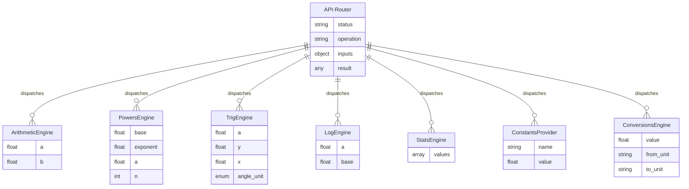

# Functional Spec — scientific-calculator-api (UNIT-001)

## Scope

| Unit | Components Covered | Source |
|---|---|---|
| UNIT-001 (scientific-calculator-api) | CMP-001 through CMP-008 | Intent specification |

## Entity Relationships

## State Machines

Not applicable. All entities are stateless value objects (request in, response out). No lifecycle states.

## Workflows

### Request Processing Workflow

1. HTTP request arrives at API Router (CMP-008)
2. Route matching — if no match, return NOT_FOUND envelope (BR-016)
3. Validate request body against Pydantic schema — if invalid, return INVALID_INPUT envelope (BR-017)
4. Dispatch to appropriate engine component based on URL path
5. Engine validates domain constraints (BR-001 through BR-015)
6. If domain error → raise exception → API Router maps to error code and returns error envelope
7. If computation overflows → raise OVERFLOW exception (BR-010)
8. Engine returns numeric result
9. API Router wraps result in SuccessResponse envelope
10. Return HTTP 200 with JSON response

### Error Handling Workflow

1. Pydantic validation failure → override 422 handler → return INVALID_INPUT envelope (400)
2. Domain constraint violation → engine raises domain exception → API Router catches → return DOMAIN_ERROR or DIVISION_BY_ZERO envelope (400)
3. Overflow → return OVERFLOW envelope (400)
4. Unknown route → return NOT_FOUND envelope (404)
5. Unexpected exception → log at ERROR level, return INTERNAL_ERROR envelope (500)
6. Never return a bare 500 without a structured error envelope

### Trigonometry Angle Conversion Workflow

1. Receive angle_unit parameter (default: radians)
2. For direct functions (sin, cos, tan): if degrees, convert input to radians before computation
3. Compute using radians internally
4. For inverse functions (asin, acos, atan, atan2): if degrees, convert result from radians to degrees
5. Return result in requested angle unit

## Rules Summary

| ID | Rule | Category | Applies to |
|---|---|---|---|
| BR-001 | Division/modulo by zero → DIVISION_BY_ZERO | validation | CMP-001 |
| BR-002 | sqrt(negative) → DOMAIN_ERROR | validation | CMP-002 |
| BR-003 | nth_root(negative, even n) → DOMAIN_ERROR | validation | CMP-002 |
| BR-004 | nth_root(negative, odd n) → valid negative result | calculation | CMP-002 |
| BR-005 | asin/acos input must be in [-1, 1] → DOMAIN_ERROR | validation | CMP-003 |
| BR-006 | acosh requires input >= 1 → DOMAIN_ERROR | validation | CMP-003 |
| BR-007 | atanh requires input in (-1, 1) exclusive → DOMAIN_ERROR | validation | CMP-003 |
| BR-008 | ln/log10/log2 require a > 0 → DOMAIN_ERROR | validation | CMP-004 |
| BR-009 | log requires a > 0, base > 0, base != 1 → DOMAIN_ERROR | validation | CMP-004 |
| BR-010 | exp/computation overflow → OVERFLOW | validation | CMP-004 |
| BR-011 | Statistics require >= 1 element → INVALID_INPUT | validation | CMP-005 |
| BR-012 | stdev/variance require >= 2 elements → INVALID_INPUT | validation | CMP-005 |
| BR-013 | Mode tie-breaking: smallest value wins | calculation | CMP-005 |
| BR-014 | Conversion units must be valid for category → INVALID_INPUT | validation | CMP-007 |
| BR-015 | angle_unit defaults to radians | policy | CMP-003 |
| BR-016 | Unknown endpoints → NOT_FOUND envelope | validation | CMP-008 |
| BR-017 | Invalid request body → INVALID_INPUT envelope | validation | CMP-008 |
| BR-018 | No bare 500s; structured error envelope always returned | policy | CMP-008 |
