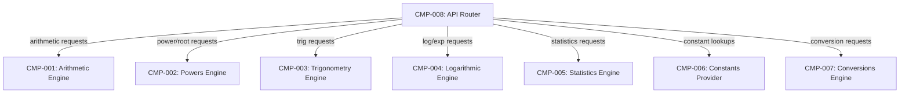

# Components

## Component Diagram

## Component Summary

| Component ID | Component | Capability | Dependencies | Entities Owned |
|---|---|---|---|---|
| CMP-001 | Arithmetic Engine | Basic arithmetic (add, subtract, multiply, divide, modulo, abs, negate) with division-by-zero detection | — | BinaryOperation, UnaryOperation |
| CMP-002 | Powers Engine | Powers and roots (power, sqrt, cbrt, square, nth_root) with domain validation | — | PowerOperation, RootOperation |
| CMP-003 | Trigonometry Engine | Trig and hyperbolic functions with degree/radian angle unit conversion and inverse function domain constraints | — | TrigOperation, Atan2Operation |
| CMP-004 | Logarithmic Engine | Logarithms (ln, log10, log2, log) and exp with domain and overflow detection | — | LogOperation |
| CMP-005 | Statistics Engine | Descriptive statistics over numeric arrays (mean, median, mode, stdev, variance, min, max, sum, count) with minimum-size validation | — | StatisticsOperation |
| CMP-006 | Constants Provider | Named mathematical constant lookup (read-only) | — | Constant |
| CMP-007 | Conversions Engine | Unit conversions across angle, temperature, length, and weight categories | — | ConversionOperation |
| CMP-008 | API Router | HTTP routing, schema validation, request dispatch, response envelope formatting, error handling | CMP-001 through CMP-007 | SuccessResponse, ErrorResponse |

## Rationale

| Component ID | Component | Why it's a separate component |
|---|---|---|
| CMP-001 | Arithmetic Engine | Distinct mathematical domain (basic operations); changes independently from trig, powers, or statistics |
| CMP-002 | Powers Engine | Distinct domain constraints (even-root negativity validation); separate concern from basic arithmetic |
| CMP-003 | Trigonometry Engine | Complex domain with angle-unit conversion logic and inverse function constraints; cohesive trig and hyperbolic operation set |
| CMP-004 | Logarithmic Engine | Distinct domain constraints (positive-only inputs, valid bases); includes exp as inverse operation; overflow detection unique to this domain |
| CMP-005 | Statistics Engine | Operates on arrays rather than scalars; fundamentally different input shape and validation (minimum element counts) |
| CMP-006 | Constants Provider | Pure data lookup — no computation, no domain errors; distinct change rate (constants added without touching math logic) |
| CMP-007 | Conversions Engine | Distinct business domain (unit mapping tables, not mathematical computation); operates on category+unit pairs |
| CMP-008 | API Router | Cross-cutting HTTP concern; owns request/response envelope and error formatting; single dispatch point with no math logic |
