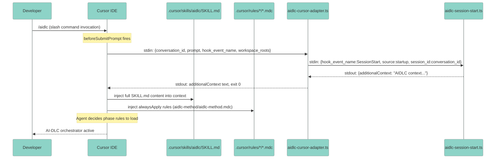
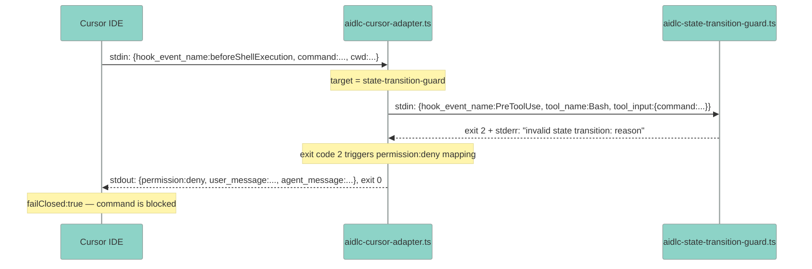
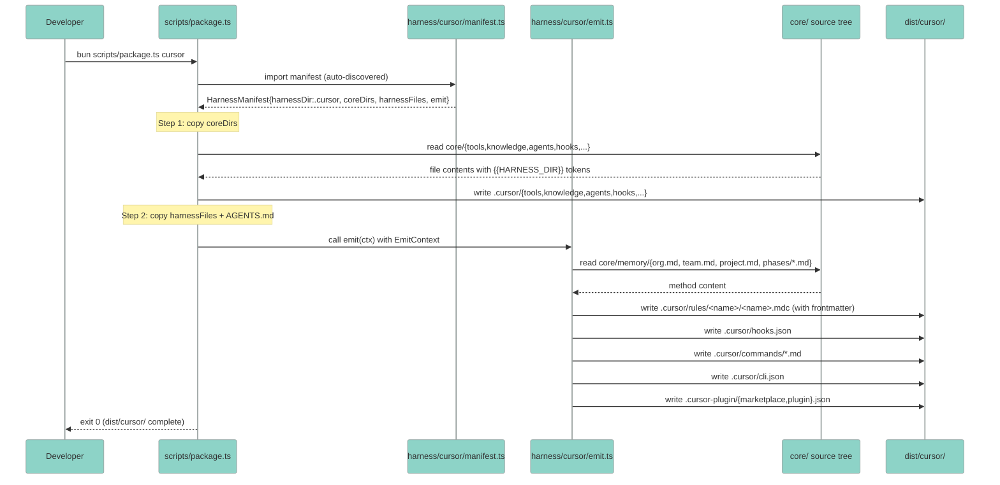
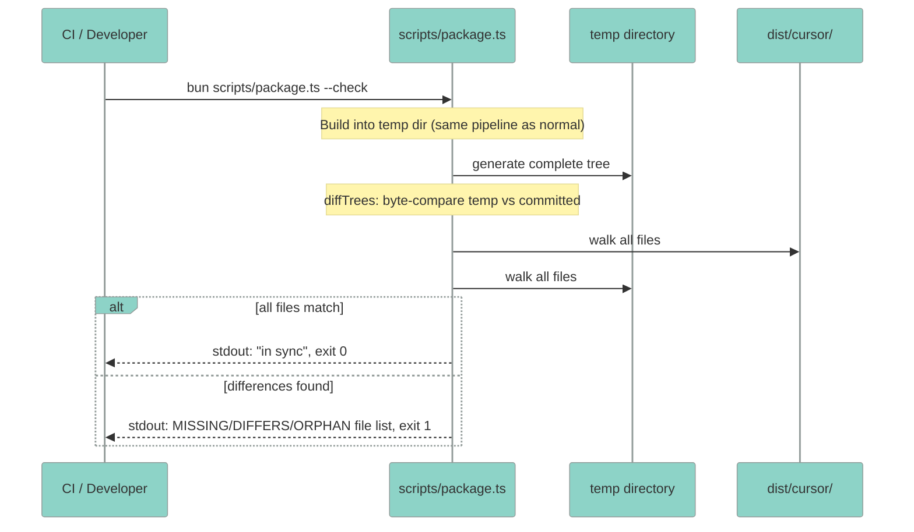
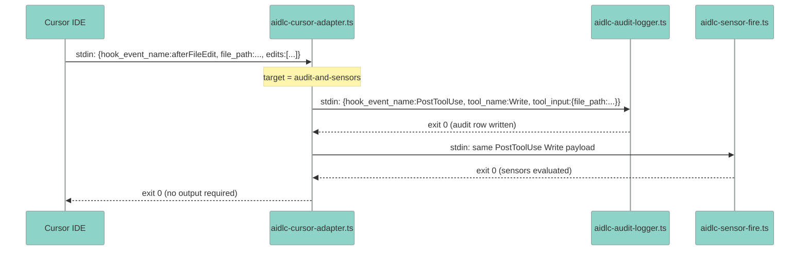
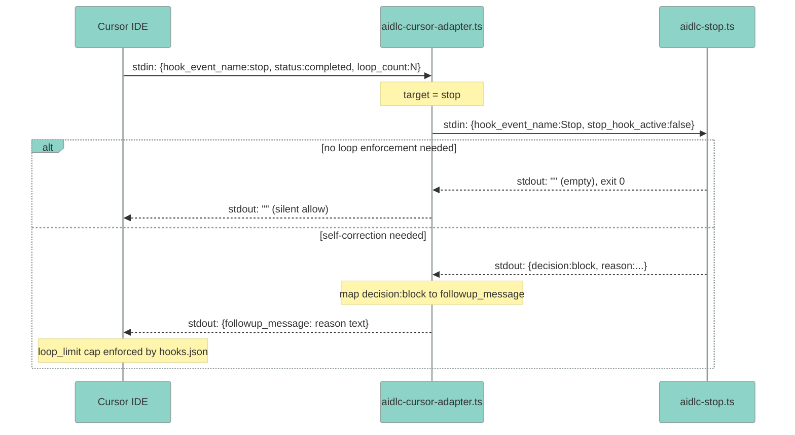
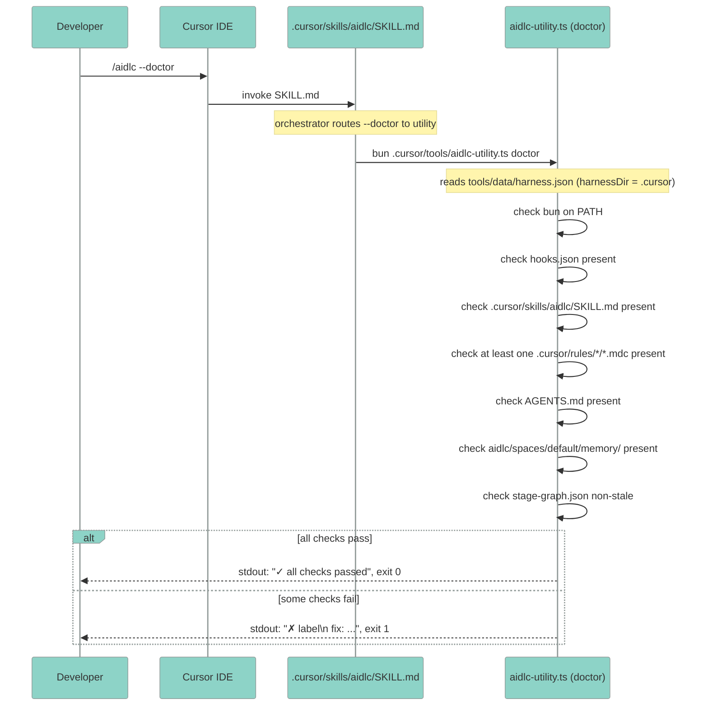
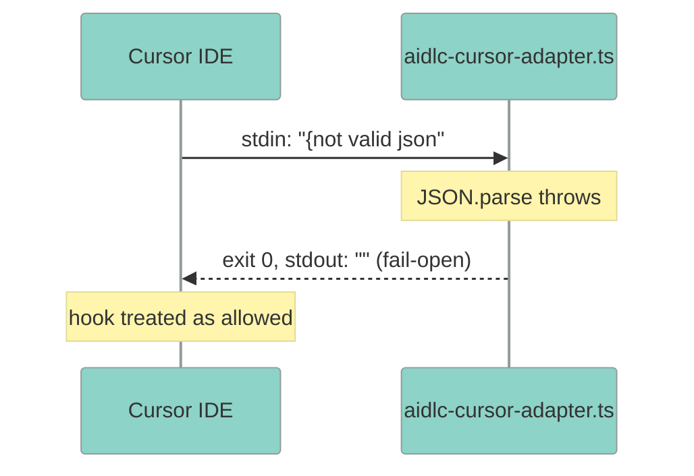

# Data Flows: Cursor IDE Harness for AI-DLC Workflows 2.0

**Document Version**: 1.0
**Last Updated**: 2026-07

---

## Table of Contents

1. [Primary Business Flows](#1-primary-business-flows)
2. [Build and Distribution Flows](#2-build-and-distribution-flows)
3. [Hook Lifecycle Flows](#3-hook-lifecycle-flows)
4. [Error Handling Flows](#4-error-handling-flows)

---

## 1. Primary Business Flows

### Flow 1.1: User Invokes /aidlc to Start a Workflow

**Trigger**: Developer types `/aidlc` in Cursor chat  
**Actors**: Developer, Cursor IDE, SKILL.md, Hook Adapter, Core Hooks, aidlc/ workspace shell  
**Outcome**: AI-DLC orchestrator begins execution with full method context injected  
**Requirements**: FR-004, FR-005, FR-006, FR-100

| Step | Description | Data | Error Handling |
|------|-------------|------|----------------|
| 1 | Developer invokes /aidlc slash command | Slash command name | N/A |
| 2 | Cursor fires `beforeSubmitPrompt` hook before sending to LLM | `{conversation_id, generation_id, prompt, hook_event_name, workspace_roots}` (snake_case) | Hook failure: fail-open (exit 0, no output) — workflow still starts |
| 3 | Adapter maps to SessionStart event and pipes to core hook | `{hook_event_name:"SessionStart", source:"startup", session_id:<conversation_id>}` | Parse error: exit 0, fail open |
| 4 | Session-start hook returns context for injection | `{additionalContext: "AIDLC WORKFLOW ACTIVE..."}` or empty if no active workflow | Hook crash: fail-open |
| 5 | Adapter unwraps additionalContext and writes to stdout | Plain text string | JSON parse error: pass raw stdout through |
| 6 | Cursor injects full SKILL.md into context on skill invocation | Full SKILL.md markdown body | File missing: Cursor shows error to user |
| 7 | Cursor injects always-apply rules (aidlc-method) | `.mdc` content with YAML frontmatter stripped | File missing: rule silently absent |

---

### Flow 1.2: Security Gate — Shell Command Blocked by State-Transition-Guard

**Trigger**: Cursor agent attempts to execute a shell command  
**Actors**: Cursor IDE, Hook Adapter, state-transition-guard core hook  
**Outcome**: Command blocked with reason displayed; agent receives deny message  
**Requirements**: FR-006, FR-007, NFR-101

| Step | Description | Data | Error Handling |
|------|-------------|------|----------------|
| 1 | Cursor fires `beforeShellExecution` before executing shell command | `{hook_event_name:"beforeShellExecution", command:"<full command>", cwd:"<path>", sandbox:false}` | N/A |
| 2 | Adapter normalizes to Claude PreToolUse shape | `{hook_event_name:"PreToolUse", tool_name:"Bash", tool_input:{command:"<command>"}}` | Malformed stdin: exit 0, allow (fail-open) |
| 3 | Guard evaluates command against workflow state | Snake_case PreToolUse JSON | Guard crash with `failClosed:true`: Cursor blocks command |
| 4 | Guard blocks: exit code 2 + stderr reason | Exit 2; stderr: "reason text" | N/A |
| 5 | Adapter translates exit 2 → permission deny JSON | `{permission:"deny", user_message:"reason", agent_message:"reason"}` | N/A |
| 6 | Cursor blocks command (failClosed:true enforced) | Permission deny response | N/A |

---

## 2. Build and Distribution Flows

### Flow 2.1: Packager Generates dist/cursor/

**Trigger**: Developer runs `bun scripts/package.ts cursor`  
**Actors**: scripts/package.ts, harness/cursor/manifest.ts, harness/cursor/emit.ts, core/ source tree  
**Outcome**: Complete `dist/cursor/` tree generated, byte-parity-ready  
**Requirements**: FR-001, FR-002, FR-003, FR-008, NFR-007

| Step | Description | Data | Error Handling |
|------|-------------|------|----------------|
| 1 | Packager discovers `harness/cursor/manifest.ts` via directory scan | File system listing of `harness/` | Missing manifest: harness silently skipped |
| 2 | Packager imports manifest | `HarnessManifest` object | TypeScript compile error: packager exits 1 |
| 3 | coreDirs copy — token substitution applied | File bytes; `{{HARNESS_DIR}}` → `.cursor` | Missing core dir: exits 1 with path |
| 4 | harnessFiles copy | File bytes; `.md` files get token substitution; `.ts`/`.json` verbatim | Missing authored file: exits 1 |
| 5 | Onboarding render | Skeleton + fills → AGENTS.md string | Missing slot: renders empty for that slot |
| 6 | Stage graph compile | Assembled tools/data/*.json | Graph error: exits 1 |
| 7 | Runner gen | Stage/scope runner SKILL.md files written to `.cursor/skills/` | Missing slug: exits 1 |
| 8 | emit() called — rules + hooks + commands + cli + plugin | EmitContext → generated file content | Size violation (>500 lines): emitter splits rule and logs warning |

---

### Flow 2.2: Byte-Parity Drift Guard

**Trigger**: Developer or CI runs `bun scripts/package.ts --check`  
**Actors**: scripts/package.ts, temp directory, dist/cursor/  
**Outcome**: Exit 0 (clean) or exit 1 with MISSING/DIFFERS/ORPHAN report  
**Requirements**: FR-008, NFR-003, NFR-007

| Step | Description | Data | Error Handling |
|------|-------------|------|----------------|
| 1 | Packager builds full tree into mkdtempSync temp directory | All 5 pipeline steps + emit() | Build error: exits 1 |
| 2 | diffTrees walks temp tree, checks each file in committed | File path + byte content | Missing temp dir: bug — exits 1 |
| 3 | Reports MISSING (built but not committed), DIFFERS (content changed), ORPHAN (committed but not rebuilt) | Problem string list | N/A |
| 4 | Exit 0 if problems array is empty; exit 1 otherwise | Exit code | N/A |

---

## 3. Hook Lifecycle Flows

### Flow 3.1: File Edit Audit Trail

**Trigger**: Cursor agent edits a file  
**Actors**: Cursor IDE, Hook Adapter, aidlc-audit-logger.ts, aidlc-sensor-fire.ts  
**Outcome**: Edit recorded in audit shard; sensors evaluated  
**Requirements**: FR-006

| Step | Description | Data | Error Handling |
|------|-------------|------|----------------|
| 1 | Cursor fires `afterFileEdit` after each file write | `{hook_event_name:"afterFileEdit", file_path:"<abs path>", edits:[{old_string, new_string}]}` | N/A |
| 2 | Adapter maps to PostToolUse Write shape | `{hook_event_name:"PostToolUse", tool_name:"Write", tool_input:{file_path:"<abs path>"}}` | Malformed stdin: exit 0, fail-open |
| 3 | Audit logger records ARTIFACT_* event to shard | Audit entry JSON appended to shard file | I/O error: exit 0, fail-open (advisory hook) |
| 4 | Sensor fire evaluates sensors against edited file | PostToolUse Write payload | Sensor crash: exit 0, fail-open |
| 5 | Adapter exits 0 (afterFileEdit has no output contract) | No output | N/A |

---

### Flow 3.2: Self-Correction via Stop Hook

**Trigger**: Cursor agent completes a turn (stop event fires)  
**Actors**: Cursor IDE, Hook Adapter, aidlc-stop.ts  
**Outcome**: Either silent allow (workflow complete) or followup_message trigger (self-correction)  
**Requirements**: FR-006

| Step | Description | Data | Error Handling |
|------|-------------|------|----------------|
| 1 | Cursor fires `stop` hook after agent turn ends | `{hook_event_name:"stop", status:"completed"/"aborted"/"error", loop_count:N}` | N/A |
| 2 | Adapter forwards as Stop event | `{hook_event_name:"Stop", stop_hook_active:false}` | Malformed stdin: exit 0, silent allow |
| 3a | Stop hook: no action needed | stdout: `""`, exit 0 | N/A |
| 3b | Stop hook: loop enforcement | stdout: `{decision:"block", reason:"..."}` | Parse error: silent allow |
| 4 | Adapter maps `decision:block` → `{followup_message: reason}` | Cursor stop hook output JSON | N/A |
| 5 | Cursor re-enters agent with followup_message (capped by loop_limit) | `{followup_message: "reason text"}` | Exceeds loop_limit: Cursor stops re-entry |

---

## 4. Error Handling Flows

### Flow 4.1: Doctor Health Check

**Trigger**: Developer runs `/aidlc --doctor` in a project with dist/cursor/ copied in  
**Actors**: Developer, Cursor IDE, aidlc-utility.ts  
**Outcome**: Pass/fail report with actionable fix guidance  
**Requirements**: FR-009

| Step | Description | Data | Error Handling |
|------|-------------|------|----------------|
| 1 | Developer invokes `/aidlc --doctor` | Slash command with `--doctor` flag | N/A |
| 2 | Orchestrator routes `--doctor` terminal flag to utility | `--doctor` argv | N/A |
| 3 | Utility reads `tools/data/harness.json` to determine harness dir | `{harnessDir:".cursor"}` | Missing: exits 1 with fix message |
| 4 | Bun check: `Bun.which("bun")` or `~/.bun/bin/bun` | Boolean | Not found: exits 1 immediately |
| 5 | hooks.json present check | File existence | Missing: fail result with fix |
| 6 | SKILL.md present check | File existence | Missing: fail result with fix |
| 7 | At least one `.mdc` rule present | `readdirSync(.cursor/rules/)` scanning for `*.mdc` | Empty rules: fail result |
| 8 | AGENTS.md present | File existence | Missing: fail result |
| 9 | workspace shell present | `aidlc/spaces/default/memory/` existence | Missing: fail result |
| 10 | stage-graph.json non-stale | Modification time check | Stale: fail result with fix |
| 11 | Aggregate and print results | `✓` / `✗` per check, fix suggestions | N/A |

---

### Flow 4.2: Hook Adapter Fails Open on Malformed Input

**Trigger**: Cursor sends non-JSON or truncated payload to hook adapter  
**Actors**: Cursor IDE, Hook Adapter  
**Outcome**: Exit 0, no output — Cursor proceeds as if hook allowed the action  
**Requirements**: FR-007, NFR-101

| Step | Description | Data | Error Handling |
|------|-------------|------|----------------|
| 1 | Cursor sends malformed JSON on stdin | Partial or invalid JSON string | N/A — this is the error scenario |
| 2 | Adapter catches JSON.parse exception | SyntaxError | Caught in try/catch — returns 0 |
| 3 | Adapter exits 0 with no output | Empty stdout | N/A |
| 4 | Cursor treats as allowed (no deny received) | No output = implicit allow | Only exception: failClosed:true hooks — Cursor blocks on any error |

---

*Document end.*
