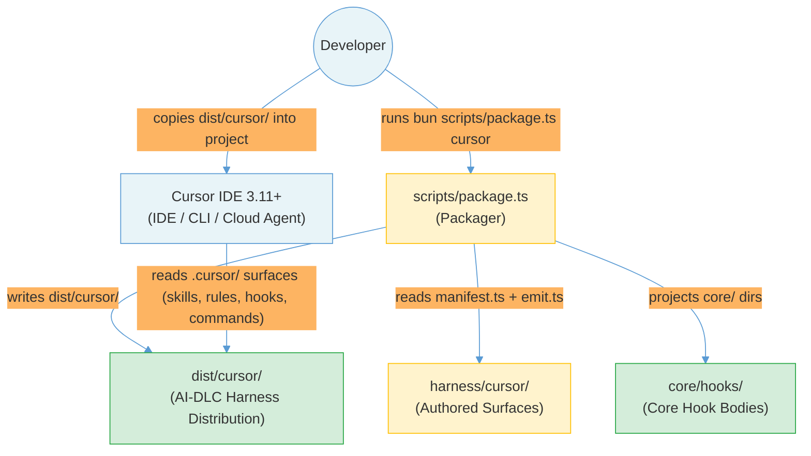
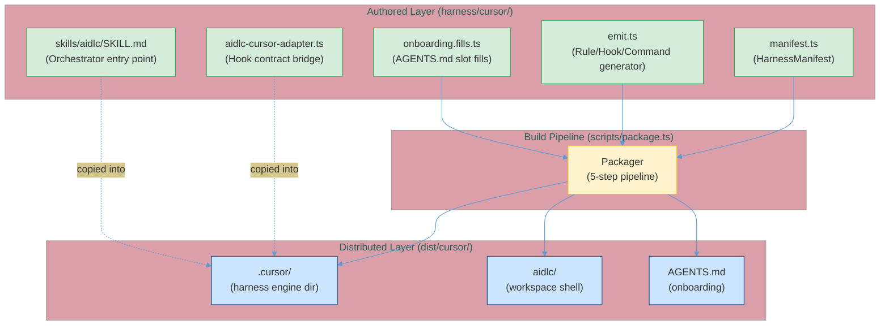
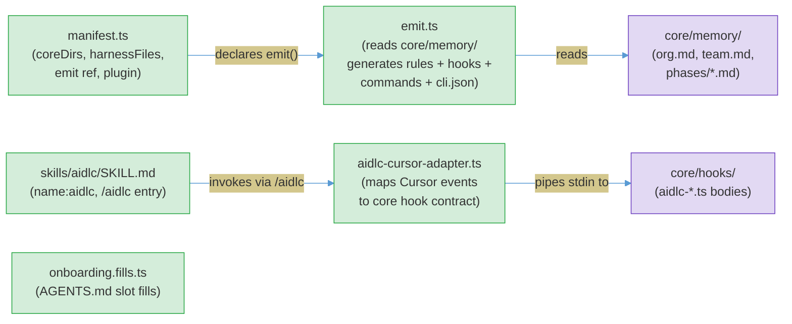
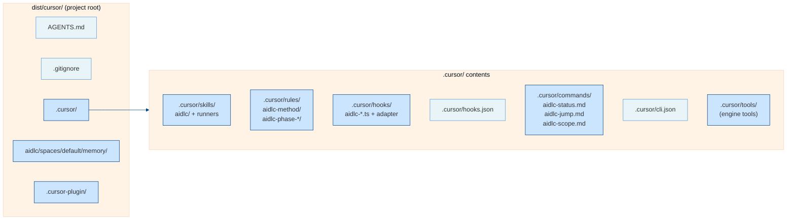
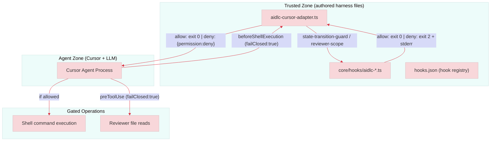

# System Architecture: Cursor IDE Harness for AI-DLC Workflows 2.0

**Document Version**: 1.0
**Last Updated**: 2026-07
**Project Type**: Developer Tooling — New Harness (no cloud infrastructure)

---

## Table of Contents

1. [Executive Summary](#1-executive-summary)
2. [Technology Summary](#2-technology-summary)
3. [System Context](#3-system-context)
4. [Core Components](#4-core-components)
5. [Interface Specifications](#5-interface-specifications)
6. [Security Architecture](#6-security-architecture)
7. [Deployment Architecture](#7-deployment-architecture)
8. [Service Limits and Scaling Considerations](#8-service-limits-and-scaling-considerations)
9. [Observability](#9-observability)

---

## 1. Executive Summary

The Cursor harness is a new distribution target for the AI-DLC multi-harness framework, enabling the
14-agent, 32-stage methodology to run natively inside Cursor IDE (and cursor-agent CLI and cloud agents)
via a ready-to-copy `dist/cursor/` tree. Users copy the tree into their project; invoking `/aidlc` starts
the AI-DLC orchestrator.

The project is a **Feature development** effort that adds one harness to an existing five-harness
monorepo. There is no cloud infrastructure — all components are local file-based developer tooling.

**Key architectural decisions:**

- `harness/cursor/manifest.ts` declares the Cursor configuration; the existing packager
  (`scripts/package.ts`) auto-discovers it via `manifest.ts` scan — zero changes to `package.ts`.
- `harness/cursor/emit.ts` generates all Cursor-native files that cannot be produced by directory
  projection: `.cursor/rules/<name>/<name>.mdc` (with YAML frontmatter), `hooks.json`, `commands/*.md`,
  `cli.json`.
- `harness/cursor/hooks/aidlc-cursor-adapter.ts` bridges Cursor's hook contract (JSON
  permission-deny, `beforeSubmitPrompt` session init) to the core Claude-shaped hook contract
  (exit-code-2 blocking, `SessionStart` event).
- Rules use the folder-per-rule `.cursor/rules/<name>/<name>.mdc` format (not the legacy single-file
  `.cursorrules`), matching NFR-100 and official Cursor documentation.
- Session initialization uses `beforeSubmitPrompt` (not `sessionStart`) for cloud agent compatibility,
  satisfying FR-100.

**Primary technologies:** TypeScript (strict, ES modules), bun runtime, Biome linter/formatter.

**Deployment:** Local developer machine — `bun scripts/package.ts cursor` generates `dist/cursor/`.

---

## 2. Technology Summary

No AWS services are used. This is a developer tooling project.

### Implementation Technologies

| Category | Technology | Scope |
|----------|------------|-------|
| Language | TypeScript (strict, ES modules) | All authored files |
| Runtime | bun | Hook scripts, packager, test runner |
| Linter/Formatter | Biome | All .ts and .json files |
| Test Runner | bun test (custom runner via tests/run-tests.ts) | All test tiers |
| Package Format | ESM (import/export) | All .ts files |
| Build Tool | bun scripts/package.ts | Harness dist generation |

### External Dependencies

| Dependency | Purpose | Version/Endpoint |
|------------|---------|------------------|
| Cursor IDE 3.11+ | Target platform — reads `.cursor/` file surfaces | 3.11+ (minimum for beforeSubmitPrompt, subagent hooks) |
| cursor-agent CLI | Headless execution environment (same file surfaces) | Same as IDE |
| Cursor Cloud Agents | Cloud execution environment (project-level hooks only) | Same file surfaces |
| Anthropic Claude models | Model provider (user-selected via Cursor UI picker) | User-governed |
| bun runtime | Hook execution, packager, test runner | Existing repo dependency |

---

## 3. System Context

The Cursor harness distribution is a file tree copied into a developer's project. Once in place,
Cursor IDE, cursor-agent CLI, and cloud agents all read the same `.cursor/` surfaces. The AI-DLC
orchestrator runs within the Cursor agent process — no network calls, no cloud backend.



### External Entities

| External Entity | Type | Interaction | Data Exchanged | Criticality |
|----------------|------|-------------|----------------|-------------|
| Developer | User | Copies dist tree; invokes `/aidlc` | File system copy; slash command invocation | High |
| Cursor IDE 3.11+ | Platform | Reads `.cursor/` file surfaces; fires hooks via hooks.json | Skills (SKILL.md), rules (.mdc files in subfolders), hook JSON payloads | High |
| cursor-agent CLI | Platform | Reads same `.cursor/` surfaces; headless execution | Same as IDE | High |
| Cursor Cloud Agents | Platform | Reads project-level `.cursor/` hooks and skills | Hook payloads (JSON stdin/stdout); skill invocations | High |
| Anthropic Claude | Model provider | Model inference within Cursor agent process | Prompts, completions (user-governed) | Medium |

---

## 4. Core Components

The harness is organized into three layers: **Authored Surfaces** (what is written by hand in
`harness/cursor/`), **Build Pipeline** (how the packager assembles them), and **Distributed Surfaces**
(what lands in `dist/cursor/` and is copied into user projects).



---

### 4.1 Authored Layer



#### manifest.ts

**Purpose:** Declares all Cursor harness parameters as `HarnessManifest` data. The packager
auto-discovers this file; no changes to `scripts/package.ts` are needed.

**Key fields:**

| Field | Value | Rationale |
|-------|-------|-----------|
| `name` | `"cursor"` | Matches `harness/cursor/` and `dist/cursor/` dir |
| `harnessDir` | `".cursor"` | Cursor's native configuration directory |
| `tierFlavor` | `"claude"` | Cursor uses Anthropic model identifiers |
| `rulesRename` | `null` | Emitter owns rule generation; no core projection rename needed |
| `skipRunnerGen` | `false` | Stage runners go to `.cursor/skills/` (standard location) |
| `emit` | reference to `emit.ts` | Emitter generates rules, hooks.json, commands, cli.json |
| `plugin` | `{ manifestDir: ".cursor-plugin", kind: "store" }` | Plugin marketplace projection |

**coreDirs** (same as Claude/Kiro/opencode):
`tools`, `aidlc-common`, `knowledge`, `sensors`, `scopes`, `agents`, `hooks`,
`skills/aidlc-session-cost`, `skills/aidlc-replay`, `skills/aidlc-outcomes-pack`

**harnessFiles** (authored files, copied verbatim):
- `skills/aidlc/SKILL.md` → `.cursor/skills/aidlc/SKILL.md`
- `skills/aidlc/question-rendering.md` → `.cursor/skills/aidlc/question-rendering.md`
- `hooks/aidlc-cursor-adapter.ts` → `.cursor/hooks/aidlc-cursor-adapter.ts`
- `dot-gitignore` → `.gitignore` (projectRoot: true)

**Dependencies:** `scripts/manifest-types.ts` (HarnessManifest type contract)

---

#### emit.ts

**Purpose:** Generates all Cursor-native file surfaces that cannot be produced by directory
projection. Called by the packager after the standard `coreDirs` copy step.

**Responsibilities:**

1. **Rule generation** — reads `core/memory/` and transposes content into `.cursor/rules/<name>/<name>.mdc`
   with appropriate YAML frontmatter. Uses clean-sweep on `.cursor/rules/` before writing to prevent
   orphaned files (mirrors codex/opencode emitter pattern).

2. **hooks.json** — generates the Cursor v1 hook registry JSON wiring **eight** AI-DLC lifecycle events
   to the cursor adapter.

3. **commands/*.md** — generates three Cursor slash command files: `aidlc-status.md`,
   `aidlc-jump.md`, `aidlc-scope.md`.

4. **cli.json** — generates the cursor-agent CLI permission file with a safe default allow/deny set.

5. **Plugin manifests** — generates `.cursor-plugin/marketplace.json` and `.cursor-plugin/plugin.json`
   for FR-101.

**Rule mapping from core/memory/:**

| Source file | Output rule folder | `alwaysApply` | `description` |
|-------------|-------------------|---------------|---------------|
| `org.md` + `team.md` + `project.md` | `aidlc-method/` | `true` | — |
| `phases/ideation.md` | `aidlc-phase-ideation/` | `false` | "AI-DLC Ideation phase methodology" |
| `phases/inception.md` | `aidlc-phase-inception/` | `false` | "AI-DLC Inception phase methodology" |
| `phases/construction.md` | `aidlc-phase-construction/` | `false` | "AI-DLC Construction phase methodology" |
| `phases/operation.md` | `aidlc-phase-operation/` | `false` | "AI-DLC Operation phase methodology" |

**Size guard:** Emitter validates each `.mdc` rule file is under 500 lines (NFR-200). If the combined
`org.md + team.md + project.md` content exceeds 500 lines, it splits into
`aidlc-method-core/aidlc-method-core.mdc` and `aidlc-method-project/aidlc-method-project.mdc`.

**Determinism:** No timestamps or random values. All file arrays sorted before iteration.
Lazy `content: () => string` emission pattern followed by a single write pass (mirrors codex pattern).

**Dependencies:** `scripts/manifest-types.ts` (EmitContext), `core/tools/aidlc-tiers.ts` (projectTier),
`node:fs`, `node:path`

---

#### aidlc-cursor-adapter.ts

**Purpose:** Bridges Cursor's hook contract to the core Claude-shaped hook contract. Every hook
registered in `hooks.json` invokes this adapter with a target name; the adapter maps the Cursor
payload to the core hook's expected format and pipes it through a bun subprocess.

**Hook event mapping:**

| Cursor event | Adapter target | Core hook | failClosed | Notes |
|---|---|---|---|---|
| `beforeSubmitPrompt` | `session-start` | `aidlc-session-start.ts` | false | First-prompt guard; cloud-compatible |
| `stop` | `stop` | `aidlc-stop.ts` | false | Maps `followup_message` for self-correction |
| `beforeShellExecution` | `state-transition-guard` | `aidlc-state-transition-guard.ts` | **true** | Security gate — shell command gating |
| `preToolUse` | `reviewer-scope` | `aidlc-reviewer-scope.ts` | **true** | Per-reviewer read-scope gate (matcher: `Read\|LS\|Glob\|Grep`) |
| `afterFileEdit` | `audit-and-sensors` | `aidlc-audit-logger.ts` + `aidlc-sensor-fire.ts` | false | File audit trail |
| `subagentStop` | `log-subagent` | `aidlc-log-subagent.ts` | false | Subagent tracking |
| `preCompact` | `validate-state` | `aidlc-validate-state.ts` | false | Pre-compaction state check |

**Key translations:**

- **Session init mapping:** `beforeSubmitPrompt` → `{ hook_event_name: "SessionStart", source: "startup", session_id: conversation_id }`. First-prompt detection via a session-scoped marker file in `aidlc/` prevents duplicate session-start fires.
- **Permission deny mapping:** When core hook exits with code 2 + stderr, adapter returns `{ "permission": "deny", "user_message": "<stderr text>", "agent_message": "<stderr text>" }` on stdout and exits 0 (Cursor's block contract).
- **afterFileEdit mapping:** `{ file_path, edits }` → `{ hook_event_name: "PostToolUse", tool_name: "Write", tool_input: { file_path } }`.
- **stop mapping:** Core `{ "decision": "block", "reason": "..." }` → Cursor `{ "followup_message": "..." }`.
- **Payload fields:** Cursor stdin is already snake_case; no camelCase translation needed (contradicts earlier project docs — research confirmed snake_case).

**Fail-open contract:** Malformed stdin exits 0, no output, on every non-failClosed target.

**Child process:** Uses `process.execPath` (not bare `"bun"`) to avoid PATH dependency.

**Dependencies:** Core hook bodies (`core/hooks/aidlc-*.ts`), `node:fs`, `node:path`

---

#### skills/aidlc/SKILL.md (Orchestrator Skill)

**Purpose:** The user-facing entry point. Cursor reads this at `.cursor/skills/aidlc/SKILL.md` and
exposes `/aidlc` as a slash command. Invoking `/aidlc` loads the full SKILL.md into agent context
and launches the AI-DLC orchestrator.

**SKILL.md frontmatter:**
```yaml
---
name: aidlc
description: AI-DLC orchestrator — launch, resume, and manage AI-DLC workflows
disable-model-invocation: false
---
```

The `name` field must match the parent folder name (`aidlc`). Content is byte-compatible with the
Claude Code and Codex SKILL.md standard (NFR-201): only Cursor-specific command names and
environment references differ.

**Dependencies:** Kiro/Claude SKILL.md as content template (high reuse)

---

#### onboarding.fills.ts

**Purpose:** Provides Cursor-specific slot content for the shared `core/templates/onboarding.md`
skeleton, rendering to `dist/cursor/AGENTS.md`.

**Fills:** `invoke: "/aidlc"`, plus slot bodies for `title_block`, `prereq_bullets`,
`prereq_bullets_tail`, `agents_note`, `structure_extra`, `guide_pointer`,
`sections_before_resumption`, `sections_after_resumption`, `gitignore_extra`.

**Dependencies:** `scripts/onboarding.ts` (OnboardingFills type)

---

### 4.2 Build Pipeline

The packager (`scripts/package.ts`) runs five steps per harness in order:

1. **Copy coreDirs** — projects `core/<src>` → `dist/cursor/.cursor/<dst>` with `{{HARNESS_DIR}}`
   token substitution. `rulesRename: null` means `rules/` stays as `rules/` (though the emitter
   owns `.cursor/rules/` entirely).

2. **Copy harnessFiles** — copies authored files from `harness/cursor/` into `dist/cursor/`.

3. **Onboarding render** — renders `core/templates/onboarding.md` with fills from `onboarding.fills.ts`,
   substitutes `{{HARNESS_DIR}}` → `.cursor`, writes to `dist/cursor/AGENTS.md`.

4. **Stage graph compile** — runs `aidlc-graph.ts compile`, writes `tools/data/stage-graph.json`
   and `scope-grid.json`.

5. **Runner gen** — writes stage/scope/init/compose runners into `.cursor/skills/` (skipRunnerGen: false).

6. **Emit** — calls `emit(ctx)` which generates rules, hooks.json, commands, cli.json, plugin manifests.

**Byte-parity guard:** `bun scripts/package.ts --check` rebuilds into a temp dir and byte-compares
against committed `dist/cursor/`. Reports MISSING, DIFFERS, or ORPHAN problems.

---

### 4.3 Distributed Layer (dist/cursor/)



**Complete file layout of `dist/cursor/`:**

```
dist/cursor/
├── AGENTS.md                              # Onboarding (from template + fills)
├── .gitignore                             # Workspace ignore rules
├── .cursor/
│   ├── skills/
│   │   ├── aidlc/
│   │   │   ├── SKILL.md                   # /aidlc entry point (authored)
│   │   │   └── question-rendering.md      # Authored helper
│   │   ├── aidlc-init/SKILL.md            # Generated by runner-gen
│   │   ├── aidlc-compose/SKILL.md         # Generated by runner-gen
│   │   ├── aidlc-<stage>/SKILL.md         # 32 stage runners (runner-gen)
│   │   ├── aidlc-session-cost/SKILL.md    # Core session skill
│   │   ├── aidlc-replay/SKILL.md          # Core session skill
│   │   └── aidlc-outcomes-pack/SKILL.md   # Core session skill
│   ├── rules/
│   │   ├── aidlc-method/aidlc-method.mdc           # alwaysApply:true (org+team+project)
│   │   ├── aidlc-phase-ideation/aidlc-phase-ideation.mdc   # alwaysApply:false + description
│   │   ├── aidlc-phase-inception/aidlc-phase-inception.mdc
│   │   ├── aidlc-phase-construction/aidlc-phase-construction.mdc
│   │   └── aidlc-phase-operation/aidlc-phase-operation.mdc
│   ├── hooks/
│   │   ├── aidlc-cursor-adapter.ts        # Authored: Cursor hook bridge
│   │   └── aidlc-*.ts                     # Core hook bodies (projected)
│   ├── hooks.json                         # Cursor v1 hook registry (emitter)
│   ├── commands/
│   │   ├── aidlc-status.md                # /aidlc-status slash command
│   │   ├── aidlc-jump.md                  # /aidlc-jump slash command
│   │   └── aidlc-scope.md                 # /aidlc-scope slash command
│   ├── cli.json                           # cursor-agent CLI permissions
│   ├── tools/                             # Engine tools (core projected)
│   ├── aidlc-common/                      # Core common utilities
│   ├── knowledge/                         # Core knowledge files
│   ├── sensors/                           # Core sensor manifests
│   ├── scopes/                            # Core scope definitions
│   └── agents/                            # Core agent persona .md files
├── aidlc/
│   └── spaces/default/memory/             # Method tree (org, team, phases)
└── .cursor-plugin/
    ├── marketplace.json                   # Plugin marketplace manifest
    └── plugin.json                        # Plugin descriptor (kind: store)
```

---

### 4.4 Test Suite

**Purpose:** Verifies harness correctness via the established codebase testing pattern.
Two new files in `tests/unit/`:

**t145-cursor-packaging.test.ts** — packaging parity test:
- Test 1: Drift guard subprocess (`bun scripts/package.ts cursor --check` exits 0)
- Test 2: Core TypeScript parity (`.ts` files byte-identical to dist/claude equivalents, excluding adapter)
- Test 3: No cross-harness prose contamination (grep for other harness dir strings)
- Test 4: Cursor-native wiring checks (hooks.json event names, `.mdc` frontmatter)
- Test 5: `/aidlc --doctor` passes in a scratch project (cpSync + aidlc-utility.ts doctor)

**t146-cursor-hook-adapter.test.ts** — adapter contract test (following t147/t149 pattern):
- Subprocess shim testing (spawnSync, not in-process)
- Fixture corpus: `tests/fixtures/cursor-hook-payloads/payloads.json`
- Assertions for each event: `beforeSubmitPrompt`, `stop`, `beforeShellExecution`, `afterFileEdit`
- `failClosed` gate test: `beforeShellExecution` returns `{"permission":"deny"}` when core exits 2
- Fail-open test: malformed stdin exits 0, no output, on all targets

**Dependencies:** `tests/harness/fixtures.ts`, `dist/cursor/` (must exist before tests run),
`node:child_process` spawnSync, `node:fs` cpSync/mkdtempSync/rmSync

---

## 5. Interface Specifications

| Source | Target | Interface Type | Protocol | Authentication | Data Format |
|--------|--------|----------------|----------|----------------|-------------|
| Developer | dist/cursor/ | File system copy | OS file I/O | None | Directory tree |
| Cursor IDE | `.cursor/skills/aidlc/SKILL.md` | Skill invocation | File read at startup; full inject on `/aidlc` | None | Markdown |
| Cursor IDE | `.cursor/rules/*/*.mdc` | Rule injection | File read (always-apply or agent-decided) | None | Markdown + YAML frontmatter |
| Cursor IDE | `hooks.json` → adapter | Hook subprocess | stdin JSON → stdout JSON; exit code | None | JSON (snake_case fields) |
| Cursor IDE | `.cursor/commands/*.md` | Command invocation | File read on `/command-name` | None | Markdown |
| cursor-agent CLI | `.cursor/cli.json` | Permission enforcement | File read at session start | None | JSON |
| Hook adapter | Core hooks | Subprocess pipe | stdin JSON → stdout JSON; exit code | None | Claude-shaped hook JSON |
| Core hooks → adapter | Cursor IDE | Permission response | stdout JSON; exit 0 | None | `{ "permission": "allow"/"deny", "user_message": string, "agent_message": string }` |
| Packager (`emit()`) | `dist/cursor/` | File generation | Direct fs write | None | TypeScript (EmitContext) |
| `--check` | `dist/cursor/` | Byte comparison | Temp-dir build + diff | None | File bytes |
| `--doctor` | `.cursor/` tree | Health check | aidlc-utility.ts subprocess | None | Human-readable stdout + exit code |

---

## 6. Security Architecture

### Security Zones

The harness operates entirely on the developer's local machine. There are no network services,
no user data, and no cloud infrastructure. Security concerns are limited to hook gating
(preventing the AI agent from running unauthorized shell commands).



### Authentication

| Component | Method | Token Type | Validation |
|-----------|--------|------------|------------|
| Hook adapter | Cursor calls adapter as subprocess | None (local process) | Process identity via file path in hooks.json |
| CLI permissions | cli.json pattern matching | None | Cursor agent enforces against Shell/Read/Write patterns |
| Core hooks | Subprocess call from adapter | None (local process) | File path verification via hooks.json |

### Authorization

| Resource | Actor | Permissions | Enforcement Point |
|----------|-------|-------------|-------------------|
| Shell command execution | Cursor agent | Allow: `bun *`, `git add/commit/status/log/diff`; Deny: `rm -rf *`, `git push *`, `git reset --hard *`, `curl *`, `wget *` | `.cursor/cli.json` (cursor-agent), `beforeShellExecution` hook (IDE) |
| State transition mutations | Cursor agent | Gated by state-transition-guard | `beforeShellExecution` with `failClosed: true` |
| Reviewer file reads | Reviewer subagents | Scoped to declared read paths | `preToolUse` with `failClosed: true` |
| Approval gates | Human developer | Must record HUMAN_TURN before gate resolution | `beforeSubmitPrompt` → session-start hook |

### Data Protection

| Data Type | At Rest | In Transit | Access Control |
|-----------|---------|------------|----------------|
| Workflow state (aidlc/) | Local file system | N/A (local only) | OS file permissions |
| Audit shards | Local file system | N/A (local only) | OS file permissions |
| Core methodology (core/memory/) | VCS (git) | N/A (local only) | Repository access |
| Generated dist files | VCS (git) | N/A (local only) | Repository access |

### Network Security Controls

Not applicable. The harness is entirely local — no network connections, no exposed ports.
The `cli.json` default deny list blocks `curl`, `wget`, and similar network tools for the
cursor-agent CLI environment.

---

## 7. Deployment Architecture

### Overview

This is a developer tooling project. There is no cloud deployment. "Deployment" means:
1. A developer runs `bun scripts/package.ts cursor` to generate `dist/cursor/`
2. The developer copies `dist/cursor/` contents into their target project

### Network Architecture

Not applicable. No cloud infrastructure, no VPCs, no subnets.

### Environment Strategy

| Environment | Purpose | Key Differences |
|-------------|---------|-----------------|
| Development (feature/cursor branch) | Author harness surfaces | Editing `harness/cursor/`; running packager locally |
| CI | Byte-parity enforcement | `bun scripts/package.ts --check` as mandatory gate; `bun tests/run-tests.ts` |
| Distribution | User project installation | Developer copies `dist/cursor/` into their project |

### Infrastructure Provisioning

Not applicable. No IaC, no cloud resources.

### Disaster Recovery

Not applicable for a local developer tooling project. If dist/ is lost, running
`bun scripts/package.ts cursor` regenerates the entire distribution from source.
The harness source in `harness/cursor/` and `core/` is under git version control.

---

## 8. Service Limits and Scaling Considerations

No AWS services are involved. Platform constraints:

| Constraint | Limit | Risk | Mitigation |
|------------|-------|------|------------|
| Cursor rule file size | 500 lines best practice | Medium — oversized rules may be truncated | Emitter validates size; splits `aidlc-method` if > 500 lines |
| Packager payload | ~200 KB combined diff | Low — single harness well under limit | N/A |
| Cursor skills discovery | Per-project `.cursor/skills/` | Low | Standard location used; no conflicts |

---

## 9. Observability

### Developer Tooling Observability

This project has no runtime metrics or cloud monitoring. Observability means build-time and
test-time feedback.

| Category | Mechanism | What is Monitored | Threshold |
|----------|-----------|-------------------|-----------|
| Build correctness | `bun scripts/package.ts cursor --check` | Byte-parity of dist/cursor/ | Exit code 0 = clean |
| Test coverage | `bun tests/run-tests.ts` | Packaging parity + adapter contract + doctor | All green |
| Lint/format | `biome check` | TypeScript + JSON quality | Exit code 0 |
| Doctor health | `/aidlc --doctor` | hooks.json, SKILL.md, rules, AGENTS.md presence | Exit code 0 |

### Incident Response

- **Detection:** CI fails on `--check` or test suite failures.
- **Response:** Author inspects `bun scripts/package.ts cursor --check` output (MISSING/DIFFERS/ORPHAN)
  and fixes the emitter or authored files.
- **Recovery:** Re-run packager; regeneration is fast (seconds).

### Backup and Recovery

`dist/cursor/` is regenerated from source on every packager run. Source is under git.
No backup strategy needed beyond standard git practices.

---

*Document end.*
